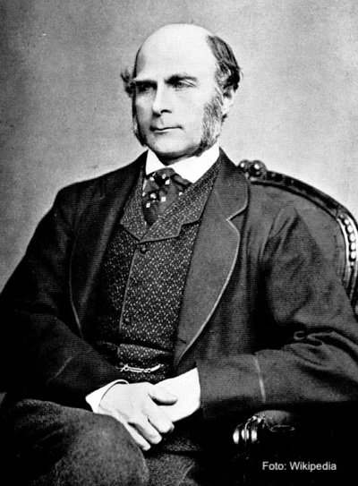
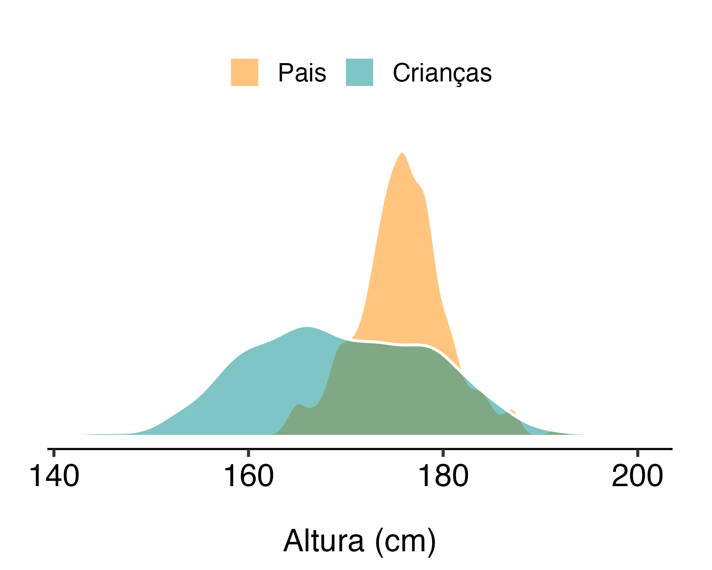
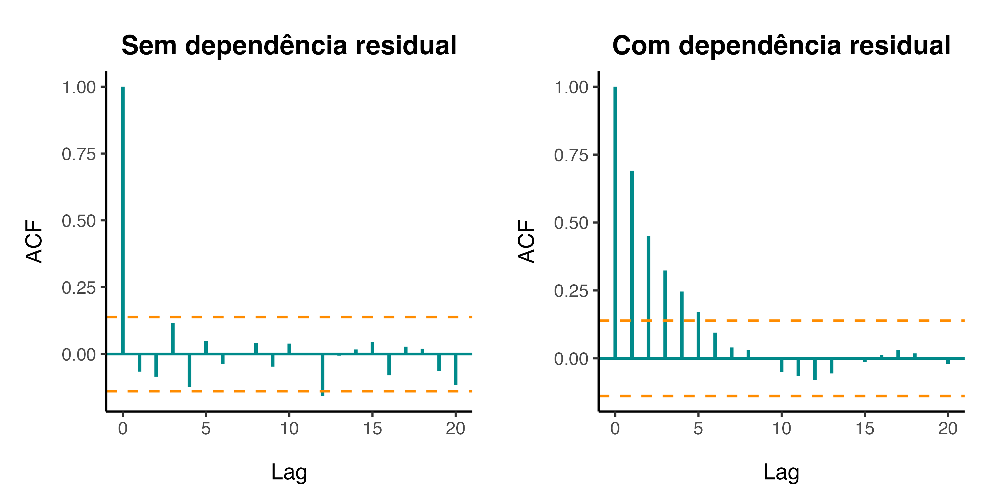
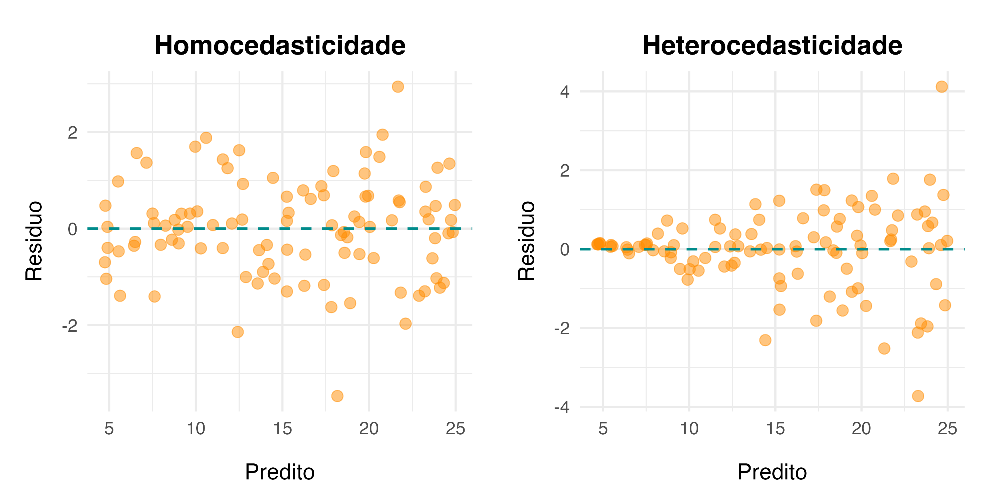
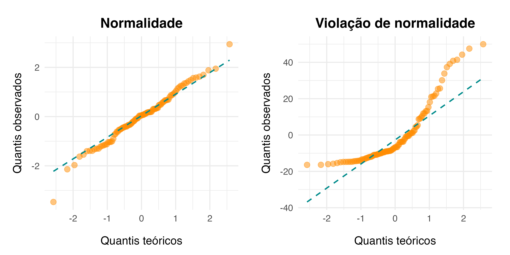

<!--- CSS box customization -->
<style>
p.comment {
background-color: #F9DCC4;
padding: 10px;
border: 1px solid black;
margin: 50px;
border-radius: 5px;
text-align: center
}
</style>


```{r setup, include=FALSE}

library(kableExtra)
library(dplyr)

```


## <span style="color: #ee6c4d;">Conteúdo programático </span> 

<br>

**1. Introdução à disciplina**  

**2. Modelos lineares (LM)** 

**3. RMarkdown (relatório)**  


---
class: inverse, center, middle

# Introdução à disciplina

---


.pull-left[

<br>

### <span style="color: #ee6c4d;">Ementa</span>
- **29/09 -** LM & RMarkdown
- **30/09 -** Métodos de inferência
- **01/10 -** GLM para dados binários
- **02/10 -** GLM para dados discretos
- **03/10 -** GLM para dados contínuos
- **06/10 -** GLM para dados categóricos
- **07/10 -** Distribuições de probabilidade complementares
- **08/10 -** GAM
- ~~**09/10 -** GAMLSS~~
- **10/10 -** Aula prática: projetos

]

.pull-right[

<br>

### <span style="color: #ee6c4d;">Horário</span>
8h00 - 12h00 (15 min de intervalo)

---------

### <span style="color: #ee6c4d;">Avaliação </span>
Guia prático sobre os tópicos da disciplina (grupo de **02-03 pessoas**)

- Relatório em formato `Bookdown (RMarkdown)`

-  <span style="color: red;">**Entrega: 17/10** </span> 

]

---

### <span style="color: #ee6c4d;">Dúvidas</span>

#### Programação: 
- https://github.com/mcruf/ECL0072-GLM_GAM/issues

#### Estatística: 
- Horário marcado via email: [macrufener@gmail.com]()


-------

### <span style="color: #ee6c4d;">Material</span>

- Página da disciplina: https://github.com/mcruf/ECL0072-GLM_GAM


---

### <span style="color: #ee6c4d;">Estatística: entre o inferno, o céu e a liberdade </span>


```{r echo=FALSE, fig.align ='center', out.width = "70%"}
knitr::include_graphics("../Figuras/bandas.png")
```


---

### <span style="color: #ee6c4d;">O detetive ecológico </span>

<br>

```{r echo=FALSE, fig.align ='center', out.width = "85%"}
knitr::include_graphics("../Figuras/ecology_and_big_data.png")
```


---

class: inverse, center, middle

# Modelos Lineares

---

### <span style="color: #ee6c4d;">**O que é um modelo?** </span> 


#### O que determina o tamanho de uma população?

--

.pull-left[

<br>

```{r echo=FALSE, fig.asp = 4, fig.align ='center'}
knitr::include_graphics("../Figuras/dinamica_pop.png")
```

]

--

.pull-right[

<br>

$$P_{t+1} = P_t + {\color{#4C7B31} N} - {\color{Tomato} M} + {\color{#4C7B31} I} - {\color{Tomato} E} $$
<br>

$$\Delta P = N-M$$ 
<br>

$$\frac{dP}{dt} = rN$$ 

]

---

### <span style="color: #ee6c4d;">**O que é um modelo?** </span> 

<br>

> <span style="color: #ee6c4d;">Expressão matemática de uma ideia</span>


> - <span style="color: #b1a7a6;">Exprime as mais diversas relações da natureza</span> 

<br>

$$\Large Y = f(X)$$

---

### <span style="color: #ee6c4d;">**O que é um modelo?** </span> 


#### Pinguins do Arquipélago Palmer

```{r echo=FALSE, out.width ="90%", fig.align ='center'}
knitr::include_graphics("../Figuras/relacao_y_x.png")
```

---

### <span style="color: #ee6c4d;">**O que é um modelo *estatístico*?** </span> 

<br>


$$\Large Y = f(X) + \color{Tomato}\varepsilon$$

```{r echo=FALSE, out.width ="100%", fig.align ='center'}
knitr::include_graphics("../Figuras/relacao_y_x_variabilidade.png")
```


---

### <span style="color: #ee6c4d;">**Tipos de relações** </span> 

<br>

```{r echo=FALSE, out.width ="100%", fig.align ='center'}
knitr::include_graphics("../Figuras/tipos_de_correlacoes.png")
```

---

### <span style="color: #ee6c4d;">**Para que são usados?** </span> 

--

**Descritivo**
  - Avaliar as relações entre as variáveis 
      - Eg.: Quais variáveis são as melhores preditoras? 

--

----
**Inferência**
  - Validar/Invalidar hipóteses 
      - Eg.: Há efeito do tratamento sobre a recuperação florestal? 

--

----
**Predições**
  - Realizar projeções 
      - Eg.: Predizer a distribuição de espécies


---


.pull-left[

<br>

```{r echo=FALSE, out.width ="70%", fig.align ='center', fig.cap="George P. Box (1919-2013)", fig.topcaption=F}
knitr::include_graphics("../Figuras/GeorgeEPBox.jpg")
```


]

.pull-right[

<br>
<br>
<br>
<br>
<br>

> <font size="6"><center> <span style="color: #ee6c4d;">Essentially, <b>all models are wrong</b>, but <b>some are useful</b></center></font></span> 

]


---

.pull-left[

<br>
<br>
<br>
<br>
<br>

> <font size="6"><center> <span style="color: #ee6c4d;"> <b>Without data</b>, you're just another <b>person with an opinion</b></center></font></span> 


]


.pull-right[

<br>
<br>


```{r echo=FALSE, out.width ="75%", fig.align ='left', fig.cap="Edwards Demming (1900-1993)", fig.topcaption=F}
knitr::include_graphics("../Figuras/Edwards_Demming.png")
```

]


---


### <span style="color: #ee6c4d;">**Modelo linear** </span> 

<br>
Base para a maioria dos modelos mais complexos


```{r echo=FALSE, out.width ="60%", fig.align ='center'}
knitr::include_graphics("../Figuras/visao_geral_lm.png")
```


---

### <span style="color: #ee6c4d;">**Modelo linear** </span><span style="color: #3e5c76;">| Visão geral  </span> 

<br>


$$\large Y = f(X_1) + \varepsilon$$
--

$$(\large  y_i = f(x_i|\theta) + \varepsilon_i)$$
--

<br>

$$\large f(X_1) = \beta_0 + \beta_1X_1 + \varepsilon$$


- $\beta_0$ - intercepto
- $\beta_1$ - parâmetro (coeficiente, peso, ...)
- $X_1$ - covariável (variável independente, preditora, input, ... )
- $Y$ - variável resposta (variável dependente, output, ...)
- $\varepsilon$ - resíduo (erro)


---
### <span style="color: #ee6c4d;">**Modelo linear** </span> <span style="color: #3e5c76;">| Visão geral  </span> 

<br>

.pull-left[

```{r echo=FALSE, out.width ="65%", fig.align ='center', fig.cap="Francis Galton (1822-1911)", fig.topcaption=F}

```

]
.pull-right[

```{r echo=FALSE, out.width ="100%", fig.align ='center'}

```
]


---
### <span style="color: #ee6c4d;">**Modelo linear** </span> <span style="color: #3e5c76;">| Visão geral  </span> 


.pull-left[

<br>
<br>

<p class="comment">
<span style="color: #ee6c4d;"><b> ATENÇÃO </b> </span> 

<br>

<br>

O termo <i>linear </i> está relacionado na <b>linearidade entre os parâmetros</b> ($\beta$) do modelo, e não em relação às variáveis preditoras (jeitão do gráfico)
</p>

]

.pull-right[

```{r echo=FALSE, out.width ="65%", fig.align ='left'}
knitr::include_graphics("../Figuras/exemplo_regressoes.png")
```

]

---

### <span style="color: #ee6c4d;">**Modelo linear** </span><span style="color: #3e5c76;">| Visão geral  </span> 

#### Quais equações são lineares?

<br>

.pull-left[
- $y = \beta_0 + \beta_1 x + \beta_2 x^2 + \varepsilon$

<br>

- $y = \beta_0 + \beta_1 \beta_2 x + \varepsilon$

<br>

- $y = \beta_0 + \beta_1log(x_1) + \varepsilon$
]

--

.pull-right[

- $y = \beta_0 + \beta_1 x_1 + \beta_2 x_2 + \beta_3 x_1 x_2 + \epsilon$

<br>

- $y = \beta_0 + e^{\beta_1x_1} + \varepsilon$

<br>

- $y = \frac{1}{1 + e^{-(\beta_0 + \beta_1 x)}} + \varepsilon$

]


---
### <span style="color: #ee6c4d;">**Modelo linear** </span> <span style="color: #3e5c76;">| Componentes  </span> 


.pull-left[

<br>
<br>
<br>
<br>
<br>


$$\Large Y = \beta_0 + \beta_1{\color{Tomato}{X_1}} + \varepsilon$$
]


.pull-right[

```{r echo=FALSE, out.width ="75%", fig.align ='left'}
knitr::include_graphics("../Figuras/tipos_de_variaveis.png")
```


]

---
### <span style="color: #ee6c4d;">**Modelo linear** </span> <span style="color: #3e5c76;">| Componentes  </span> 


.pull-left[

<br>


```{r echo=FALSE, out.width ="70%", fig.align ='center'}
knitr::include_graphics("../Figuras/tipos_de_variaveis.png")
```

]


.pull-right[


#### <span style="color: #ee6c4d;">LM </span>

- Quando $X$ reúne apenas variáveis *quantitativas*

-------

#### <span style="color: #ee6c4d;">ANOVA </span>

- Quando $X$ reúne apenas variáveis *qualitativas*

-------

#### <span style="color: #ee6c4d;">ANCOVA </span>

- Quando $X$ reúne variáveis *quantitativas* E *qualitativas*


]

---


### <span style="color: #ee6c4d;">**Modelo linear** </span><span style="color: #3e5c76;">| Componentes  </span>  

<br>
<br>

$$Y = \beta_0 + \beta_1{X_1} + \color{Tomato}\varepsilon$$


$$\varepsilon \sim N(0, \sigma^2) $$

<p class="comment">


$$\large y|\mathbf{X},\beta,\sigma =  N(\mu, \sigma^2)$$

</p>


---
### <span style="color: #ee6c4d;">**Modelo linear** </span><span style="color: #3e5c76;">| Componentes  </span>  


```{r echo=FALSE, out.width ="70%", fig.align ='center'}
knitr::include_graphics("../Figuras/Exemplo_residuo.jpeg")
```


---

### <span style="color: #ee6c4d;">**Modelo linear** </span><span style="color: #3e5c76;">| Por trás dos bastidores </span>

<br>

Todo modelo estatísitico pode ser formulado por matrizes

- Permite usar álgebra linear para resolver os modelos
- Facilita a implementação computacional e otimizações

<br>

<center> $\Large \mathbf{y} = \mathbf{X} \boldsymbol{\beta} + \boldsymbol{\varepsilon}$ </center>

<br>

--

- **y** - vetor da variável resposta ($n \times 1$)
- **X** - matriz de design; inclui os preditores e intercepto ($n \times p$)
- $\mathbf{\beta}$ - vetor dos parâmetros ($p \times 1$)
- $\varepsilon$ - vetor dos resíduos 

---
### <span style="color: #ee6c4d;">**Modelo linear** </span><span style="color: #3e5c76;">| Por trás dos bastidores </span>

<br>

.pull-left[

```{r echo=F, message=F, warning=F}

library(kableExtra)


dados <- read.csv("~/Library/CloudStorage/OneDrive-Personal/Arbeit/Lectures_and_talks/UFRN/Lectures/ECL0072-GLM_GAM/Dados/palmerpenguins_extended.csv")

set.seed(123)
dados %>%
  group_by(species) %>%
  sample_n(size =2) %>%
  select(c("bill_length_mm","body_mass_g")) %>%
  kable(align = "ccc")

```

]

.pull-right[

<br>

```{r echo=FALSE, out.width ="80%", fig.align ='center'}
knitr::include_graphics("../Figuras/palmerpenguins.png")
```
]

---

### <span style="color: #ee6c4d;">**Modelo linear** </span><span style="color: #3e5c76;">| Por trás dos bastidores </span>

<br>

.pull-left[

```{r echo=F, message=F, warning=F}

set.seed(123)
dados %>%
  group_by(species) %>%
  sample_n(size =2) %>%
  select(c("bill_length_mm","body_mass_g")) %>%
  kable(align = "ccc")

```

]


.pull-right[

$Peso_i = \beta_0 + \beta_1LarguraBico_i + \varepsilon_i$


]


---
### <span style="color: #ee6c4d;">**Modelo linear** </span><span style="color: #3e5c76;">| Por trás dos bastidores </span>

<br>

.pull-left[

```{r echo=F, message=F, warning=F}

set.seed(123)
dados %>%
  group_by(species) %>%
  sample_n(size =2) %>%
  select(c("bill_length_mm","body_mass_g")) %>%
  kable(align = "ccc")

```

]

.pull-right[

$Peso_i = \beta_0 + \beta_1LarguraBico_i + \varepsilon_i$

<br>

$$\color{#8b8c89}{5330 = \beta_0 + \beta_130.5 + \varepsilon_1}$$
  
$$\color{#8b8c89}{5126 = \beta_0 + \beta_158.3 + \varepsilon_2}$$
    
$$\color{#8b8c89}{3392 = \beta_0 + \beta_133.6 + \varepsilon_3}$$


]

---
### <span style="color: #ee6c4d;">**Modelo linear** </span><span style="color: #3e5c76;">| Por trás dos bastidores </span>


<br>

.pull-left[


```{r echo=F, message=F, warning=F}

set.seed(123)
dados %>%
  group_by(species) %>%
  sample_n(size =2) %>%
  select(c("bill_length_mm","body_mass_g")) %>%
  kable(align = "ccc")

```


]
.pull-right[
$Peso_i = \beta_0 + \beta_1LarguraBico_i + \varepsilon_i$

<br>

$$
\begin{bmatrix}
5330 \\
5126 \\
3392 \\
4194 \\
7482 \\
7306
\end{bmatrix}
=
\begin{bmatrix}
1 & 30.5 \\
1 & 58.3 \\
1 & 33.6 \\
1 & 27.6 \\
1 & 57.2 \\
1 & 75.0
\end{bmatrix}
\begin{bmatrix}
\beta_0 \\
\beta_1
\end{bmatrix}
+
\begin{bmatrix}
\varepsilon_1 \\
\varepsilon_2 \\
\varepsilon_3 \\
\varepsilon_4 \\
\varepsilon_5 \\
\varepsilon_6
\end{bmatrix}
$$
]

---
### <span style="color: #ee6c4d;">**Modelo linear** </span><span style="color: #3e5c76;">| Por trás dos bastidores </span>

#### ANOVA (um fator)

<br>

.pull-left[
```{r echo=F, message=F, warning=F}

set.seed(123)
dados %>%
  group_by(species) %>%
  sample_n(size =2) %>%
  select(c("bill_length_mm","body_mass_g")) %>%
  kable(align = "ccc")

```
]

.pull-right[

$Peso_i = \beta_0 + \sum_{j=1}^{J-1} \beta_j \cdot Especie_{i,j} + \varepsilon_i$


<p class="comment">
<span style="color: #ee6c4d;"><b> ATENÇÃO </b> </span> 

<br>

O primeiro nível do fator é sempre absorvido pelo intercepto $\beta_0$ - i.e., nível de referência (tudo será comparado relativo ao intercepto).

<br>

</p>

]

---
### <span style="color: #ee6c4d;">**Modelo linear** </span><span style="color: #3e5c76;">| Por trás dos bastidores </span>

#### ANOVA (um fator)

<br>

.pull-left[
```{r echo=F, message=F, warning=F}

set.seed(123)
dados %>%
  group_by(species) %>%
  sample_n(size =2) %>%
  select(c("bill_length_mm","body_mass_g")) %>%
  kable(align = "ccc")

```
]

.pull-right[


$$\small Peso_i = \beta_0 + \beta_1 \cdot \text{Chinstrap}_i + \beta_2 \cdot \text{Gentoo}_i + \varepsilon_i$$

<br>

$\small Adelie$ como nível de referência

$\small Especie_{i,1}$ = 1 se *Chinstrap*, 0 contrário

$\small Especie_{i,2}$ = 1 se *Gentoo*, 0 contrário

]

---
### <span style="color: #ee6c4d;">**Modelo linear** </span><span style="color: #3e5c76;">| Por trás dos bastidores </span>

#### ANOVA (um fator)

<br>

.pull-left[
```{r echo=F, message=F, warning=F}

set.seed(123)
dados %>%
  group_by(species) %>%
  sample_n(size =2) %>%
  select(c("bill_length_mm","body_mass_g")) %>%
  kable(align = "ccc")

```
]

.pull-right[

$$\small Peso_i = \beta_0 + \beta_1 \cdot \text{Chinstrap}_i + \beta_2 \cdot \text{Gentoo}_i + \varepsilon_i$$

<br>

$$\color{#8b8c89}{5330 = \beta_0 + \beta_1 \cdot 0 + \beta_2 \cdot 0 + \varepsilon_1}$$
  
$$\color{#8b8c89}{3392 = \beta_0 + \beta_1 \cdot 1 + \beta_2 \cdot 0 + \varepsilon_3}$$


$$\color{#8b8c89}{7482 = \beta_0 + \beta_1 \cdot 0 + \beta_2 \cdot 1 + \varepsilon_5}$$


]


---
### <span style="color: #ee6c4d;">**Modelo linear** </span><span style="color: #3e5c76;">| Por trás dos bastidores </span>

#### ANOVA (um fator)

<br>

.pull-left[
```{r echo=F, message=F, warning=F}

set.seed(123)
dados %>%
  group_by(species) %>%
  sample_n(size =2) %>%
  select(c("bill_length_mm","body_mass_g")) %>%
  kable(align = "ccc")

```
]

.pull-right[

$$\small Peso_i = \beta_0 + \beta_1 \cdot \text{Chinstrap}_i + \beta_2 \cdot \text{Gentoo}_i + \varepsilon_i$$

<br>

$$
\begin{bmatrix}
5330 \\
5126 \\
3392 \\
4194 \\
7482 \\
7306
\end{bmatrix}
=
\begin{bmatrix}
1 & 0 & 0\\
1 & 0 & 0\\
1 & 1 & 0\\
1 & 1 & 0\\
1 & 0 & 1\\
1 & 0 & 1
\end{bmatrix}
\cdot
\begin{bmatrix}
\beta_1 \\
\beta_2
\end{bmatrix}
+
\begin{bmatrix}
\varepsilon_1 \\
\varepsilon_2 \\
\varepsilon_3 \\
\varepsilon_4 \\
\varepsilon_5 \\
\varepsilon_6
\end{bmatrix}
$$


]

---
### <span style="color: #ee6c4d;">**Modelo linear** </span><span style="color: #3e5c76;">| Pressupostos </span>

<br>

Todo modelo estatístico é baseado em um conjunto de pressupostos

--

<br>
- **Representatividade**
  - As amostras são representativas da população
  - "*Garbage in, garbage out*"

--

<br>
- **Aditividade & Linearidade**
  - O modelo é aditivo e linear na relação de seus parâmetros

---
### <span style="color: #ee6c4d;">**Modelo linear** </span><span style="color: #3e5c76;">| Pressupostos </span>

<br>

Todo modelo estatístico é baseado em um conjunto de pressupostos

<br>
- **Resíduos**
  - Independentes 
  - Homocedásticos (variância constante)
  - Normalidade

---
### <span style="color: #ee6c4d;">**Modelo linear** </span><span style="color: #3e5c76;">| Pressupostos </span>

#### Independência residual

```{r echo=FALSE, fig.align ='center', out.width = "100%"}

```

---
### <span style="color: #ee6c4d;">**Modelo linear** </span><span style="color: #3e5c76;">| Pressupostos </span>

#### Homocedasticidade

```{r echo=FALSE, fig.align ='center', out.width = "100%"}

```

---
### <span style="color: #ee6c4d;">**Modelo linear** </span><span style="color: #3e5c76;">| Pressupostos </span>

#### Normalidade

```{r echo=FALSE, fig.align ='center', out.width = "70%"}

```


---
class: inverse, center, middle

# RMarkdown

```{r echo=FALSE, fig.align ='center', out.width = "40%"}
knitr::include_graphics("../Figuras/Rmarkdown.png")
```


---

### <span style="color: #ee6c4d;">**O que é?** </span> 


Ecosistema que permite criar documentos *dinâmicos*, misturando códigos de programação (e.g., R) com texto em `Markdown`.

--

- **Markdown:** é uma linguagem de marcação 

    - Apenas dizem como algo deve ser entendido
      - Não é uma linguagem de *programação* porque não têm capacidade de processamento e execução de funções
--
      > Por exemplo: as linguagens HTML e YAML não são liguagens de programação, uma vez que apenas dizem como uma página web está estruturada e "maquiada", mas não executa nenhum processamento


---
### <span style="color: #ee6c4d;">**Para que serve?** </span> 

- Relatórios em diversos formatos (e.g., PDF, Word, HTML)
- Artigos científicos
- Livros e blogs (Bookdown e Blogdown)
- Apresentações em slides (e.g., PowerPoint, HTML, LaTeX)
- Aplicativos via Shiny (Rshiny)
- Dashboards 
- Websites 

Veja [aqui](https://rmarkdown.rstudio.com/formats.html) os demais formatos disponíveis no RMarkdown

---
### <span style="color: #ee6c4d;">**Como funciona?** </span> 

<br>
<br>

```{r echo=FALSE, fig.align ='center', out.width = "90%"}
knitr::include_graphics("../Figuras/Rmarkdown_workflow.png")
```

---

### <span style="color: #ee6c4d;">**Qual a importância?** </span> 


---
### <span style="color: #ee6c4d;">**Relatório via RMarkdown** </span> 

```{r echo=T}

# install.packages("bookdwon")
library("bookdown")

```
  