## <span style="color: #ee6c4d;">Conteúdo programático </span> 

<br>

**1. Métodos de inferência**  

**2. Pressupostos, diagnósticos e avaliação de modelos** 

<br>

- Sugestão de leitura:
  - Cap. 11: regression and other stories (Gelman)
  -

---
### <span style="color: #ee6c4d;">**Métodos de inferência** </span>

<br>

```{r echo=FALSE, out.width ="80%", fig.align ='center'}
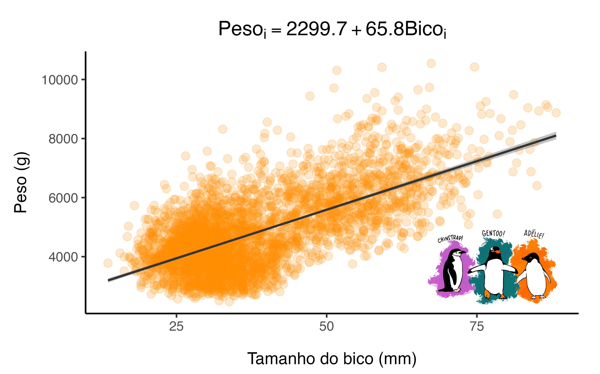
```


---
### <span style="color: #ee6c4d;">**Métodos de inferência** </span>


#### Como estimamos (inferimos) as relações da natureza?

<br>

--

- 1) Definir o modelo que descreve o sistema em estudo (i.e., distribuição de probabilidade)
    - Função será utilizada para predições

--

<br>

- 2) Identificar possíveis valores para os parâmetros desconhecidos do modelo 

--

<br>

- 3) Avaliar a incerteza dos parâmetros estimados
    - Exploar a função em torno de valores de parâmetros plausíveis (espaço paramétrico; *parameter space*)

---
### <span style="color: #ee6c4d;">**Métodos de inferência** </span>

#### Como estimamos (inferimos) as relações da natureza?

<br>

- **2) Identificar possíveis valores para os parâmetros desconhecidos do modelo**

    - Método dos momentos
    - Método dos mínimos quadrados
    - Método de máxima verossimilhança
    - Método bayesiano

---
### <span style="color: #ee6c4d;">**Métodos de inferência** </span><span style="color: #3e5c76;">| Mínimos quadrados (OLS)  </span> 


.pull-left[

<br>


```{r echo=FALSE, out.width ="80%", fig.align ='center', fig.cap="Carl F. Gauss (1777-1855)", fig.topcaption=F}
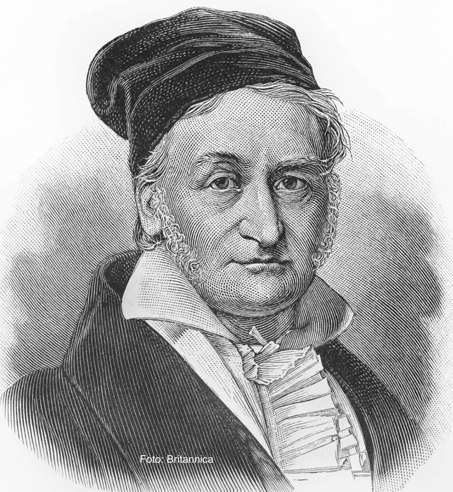
```

]

.pull-right[


```{r echo=FALSE, out.width ="80%", fig.align ='center'}
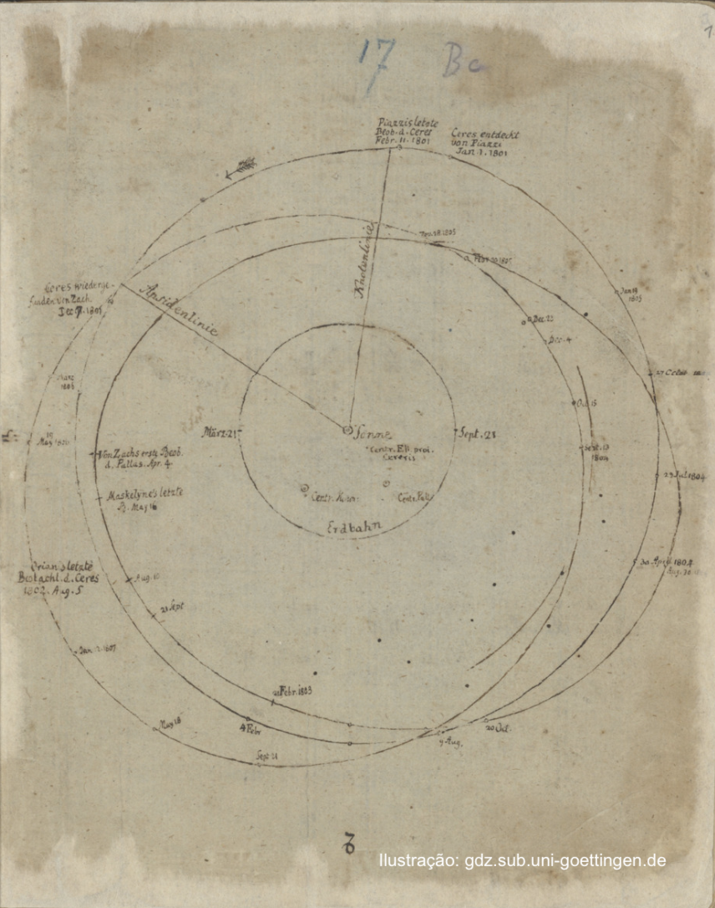
```

]

---
### <span style="color: #ee6c4d;">**Métodos de inferência** </span><span style="color: #3e5c76;">| Mínimos quadrados (OLS)  </span> 


.pull-left[

<br>
<br>

```{r echo=FALSE,fig.align ='center'}
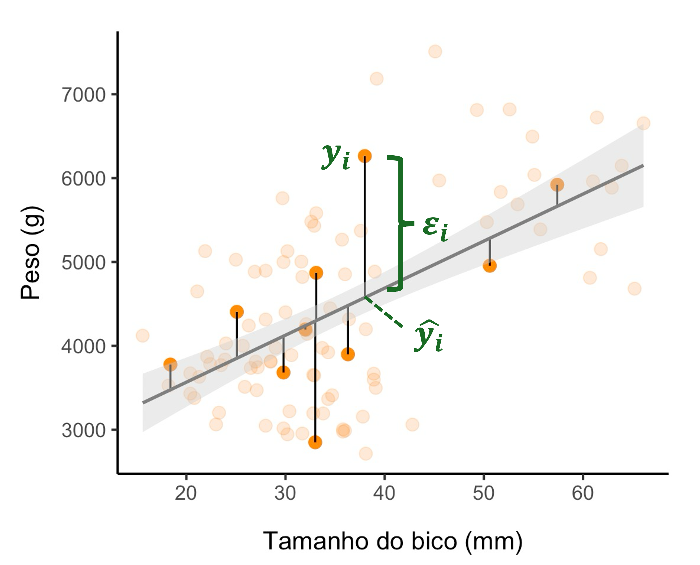
```

]


.pull.right[


<br>
<br>


$$\large y_i = f(x_i | \theta) + \varepsilon_i$$
<br>

$$\large \varepsilon_i = y_i - f(x_i|\theta)$$

]


.pull-right[
<p class="comment">

<b>Lembrando que:</b>

$$ f(x_i|\theta) = \beta_0 + \beta_1x_i = \mu_i \\
i = 1, ..., n
$$
</p>
]


---
### <span style="color: #ee6c4d;">**Métodos de inferência** </span><span style="color: #3e5c76;">| Mínimos quadrados (OLS)  </span> 

<br>

.pull-left[
```{r echo=FALSE,fig.align ='center', out.width ="100%"}
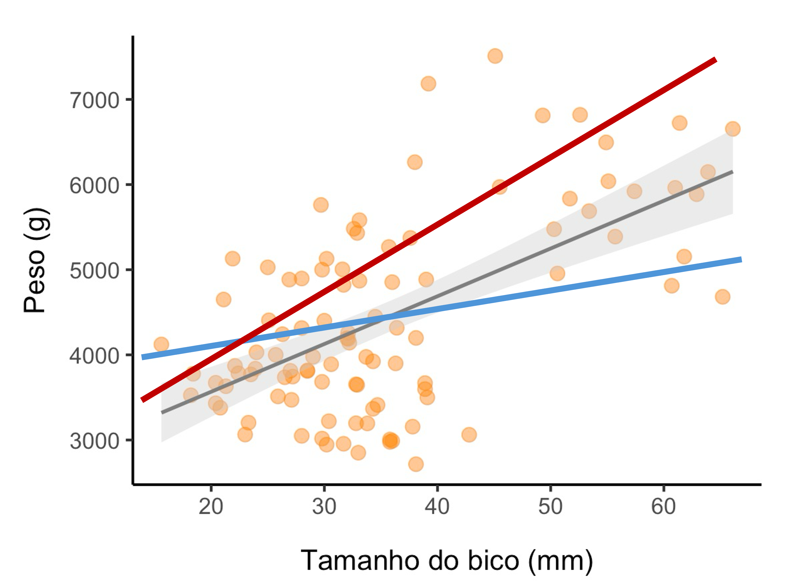
```

]

.pull-right[


<br>
<br>

<p class="comment">

<b>Achar a linha que melhor se ajusta aos dados!</b>

</p>


]


---
### <span style="color: #ee6c4d;">**Métodos de inferência** </span><span style="color: #3e5c76;">| Mínimos quadrados (OLS)  </span> 

<br>

$$\large y_i = f(x_i | \theta) + \varepsilon_i$$


$$\large \varepsilon_i = y_i - f(x_i|\theta)$$

<br>


$$\large \text{SQR} = min \sum_{i=1}^{n} (y_i - f(x_i|\theta))^2$$


---
### <span style="color: #ee6c4d;">**Métodos de inferência** </span><span style="color: #3e5c76;">| Mínimos quadrados (OLS)  </span> 

<br>

$$\large y_i = f(x_i | \theta) + \varepsilon_i$$

--

$$\large \varepsilon_i = y_i - f(x_i|\theta)$$

<br>

$$\large \text{SQR} = \underbrace{min \sum_{i=1}^{n} (y_i - f(x_i|\theta))^2}_
{\text{Diferenciar a função em relação a }\ \theta}$$

$\large \widehat{\beta_0} = \overline{y} - \widehat{\beta_1}~\overline{x}$

$\large \widehat{\beta_1} = r \frac{\sigma_y}{\sigma_x}$

.footnote[ **r** = coeficiente de correlação;  **σ** = desvio padrão.]


---

### <span style="color: #ee6c4d;">**Métodos de inferência** </span><span style="color: #3e5c76;">| Máxima verossimilhança  </span> 
<br>

.pull-left[
<br>
<br>

- Formalizou a teoria de máxima verossimilhança 
  - **estatística frequentista**
      - <span style="color: #ee6c4d;">Intervalo de confiança</span>
      - <span style="color: #ee6c4d;">Teste de hipótese (p-valor...)</span>
      - <span style="color: #ee6c4d;">Comparação entre modelos</span>

]

.pull-right[

```{r echo=FALSE, out.width ="66%", fig.align ='center', fig.cap="Ronald A. Fisher (1890-1962)", fig.topcaption=F}
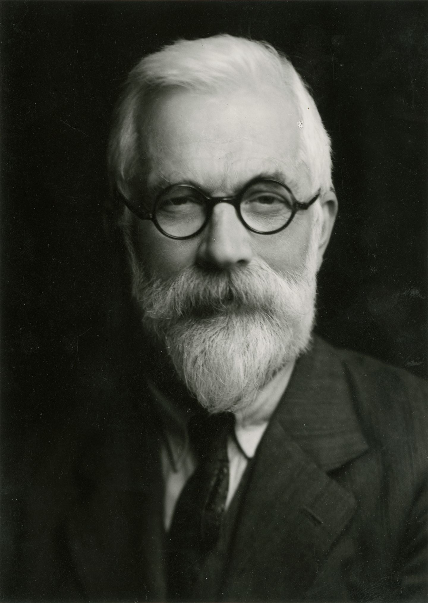
```


]

---
### <span style="color: #ee6c4d;">**Métodos de inferência** </span><span style="color: #3e5c76;">| Máxima verossimilhança  </span> 

#### Entendendo o método:

<br>

- Os dados (i.e, $Y$) surgem de um processo aleatório
  - podem ser descritos por um modelo probabilístico!

---
### <span style="color: #ee6c4d;">**Métodos de inferência** </span><span style="color: #3e5c76;">| Máxima verossimilhança  </span> 

#### Entendendo o método:

$$\large Y \sim N(\mu, \sigma^2)$$


```{r echo=FALSE, out.width ="80%", fig.align ='center'}
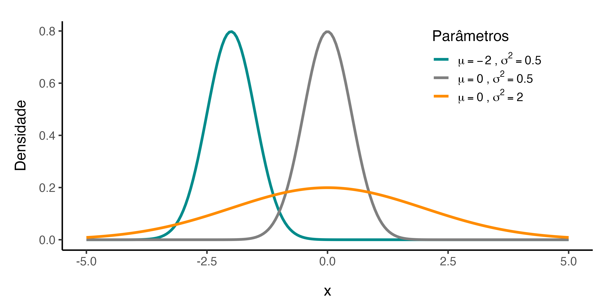
```


---
### <span style="color: #ee6c4d;">**Métodos de inferência** </span><span style="color: #3e5c76;">| Máxima verossimilhança  </span> 

#### Entendendo o método:
<br>

- Dado o modelo probabilístico, deseja-se encontrar os valores dos parâmetros ($\theta$) que mais provavelmente geraram os dados observados


---
### <span style="color: #ee6c4d;">**Métodos de inferência** </span><span style="color: #3e5c76;">| Máxima verossimilhança  </span> 


#### Confrontando os dados com a distribuição de probabilidade

<br>

```{r echo=FALSE, out.width ="70%", fig.align ='center'}
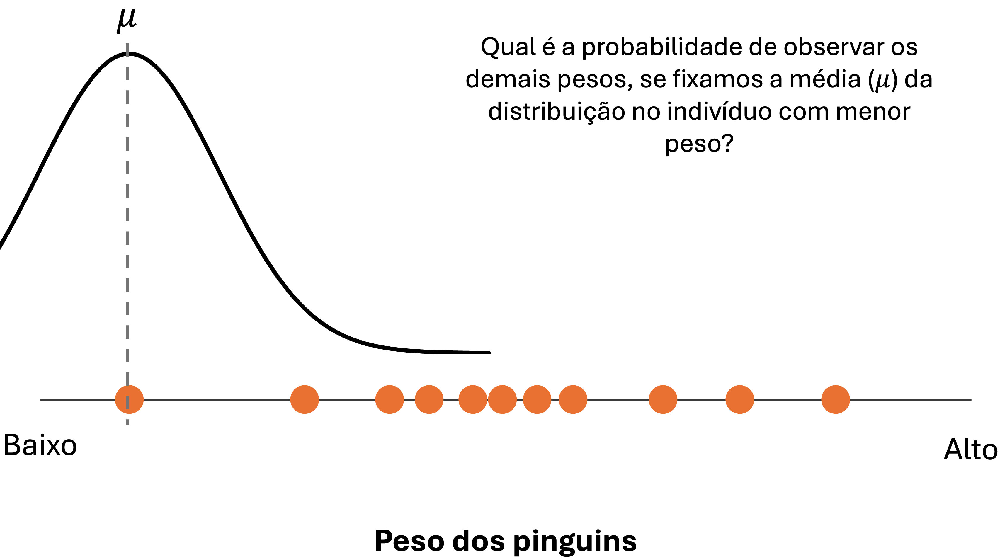
```


---

### <span style="color: #ee6c4d;">**Métodos de inferência** </span><span style="color: #3e5c76;">| Máxima verossimilhança  </span> 


#### Confrontando os dados com a distribuição de probabilidade

<br>

```{r echo=FALSE, out.width ="70%", fig.align ='center'}
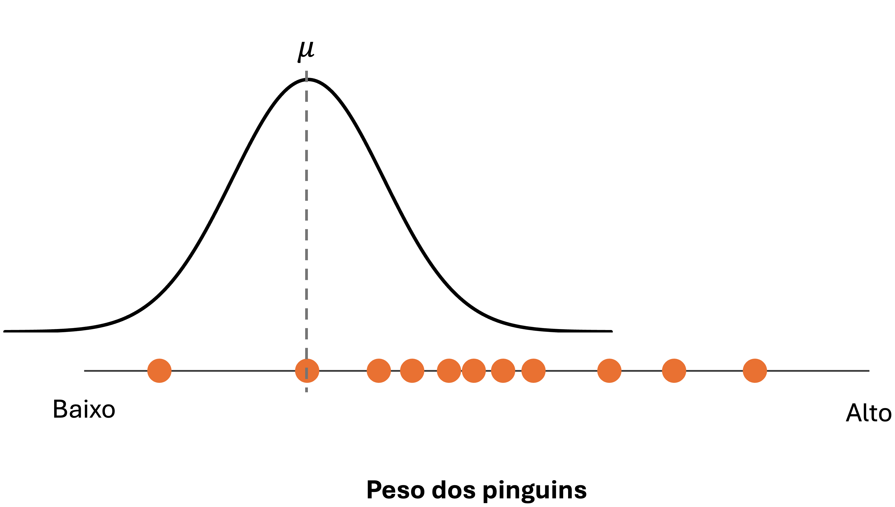
```


---

### <span style="color: #ee6c4d;">**Métodos de inferência** </span><span style="color: #3e5c76;">| Máxima verossimilhança  </span> 


#### Confrontando os dados com a distribuição de probabilidade

<br>

```{r echo=FALSE, out.width ="70%", fig.align ='center'}
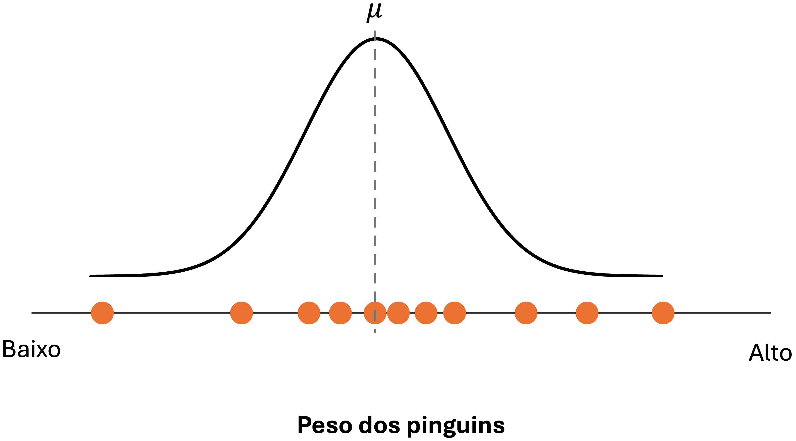
```

---

### <span style="color: #ee6c4d;">**Métodos de inferência** </span><span style="color: #3e5c76;">| Máxima verossimilhança  </span> 


#### Confrontando os dados com a distribuição de probabilidade

<br>

```{r echo=FALSE, out.width ="70%", fig.align ='center'}
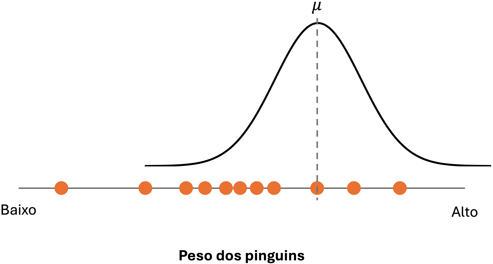
```

---

### <span style="color: #ee6c4d;">**Métodos de inferência** </span><span style="color: #3e5c76;">| Máxima verossimilhança  </span> 


#### Confrontando os dados com a distribuição de probabilidade


```{r echo=FALSE, out.width ="90%", fig.align ='center'}
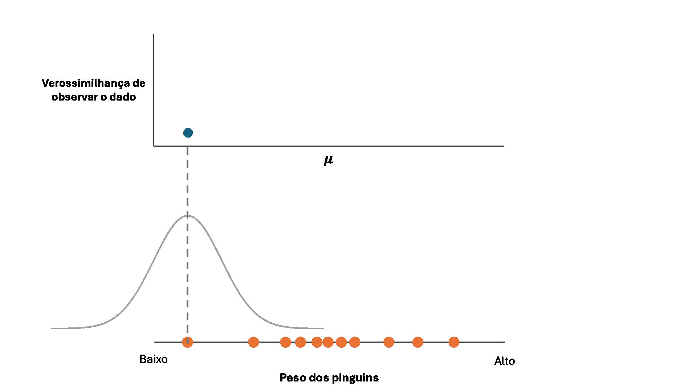
```

---
### <span style="color: #ee6c4d;">**Métodos de inferência** </span><span style="color: #3e5c76;">| Máxima verossimilhança  </span> 


#### Confrontando os dados com a distribuição de probabilidade

.pull-left[
<br>

```{r echo=FALSE, out.width ="100%", fig.align ='center'}
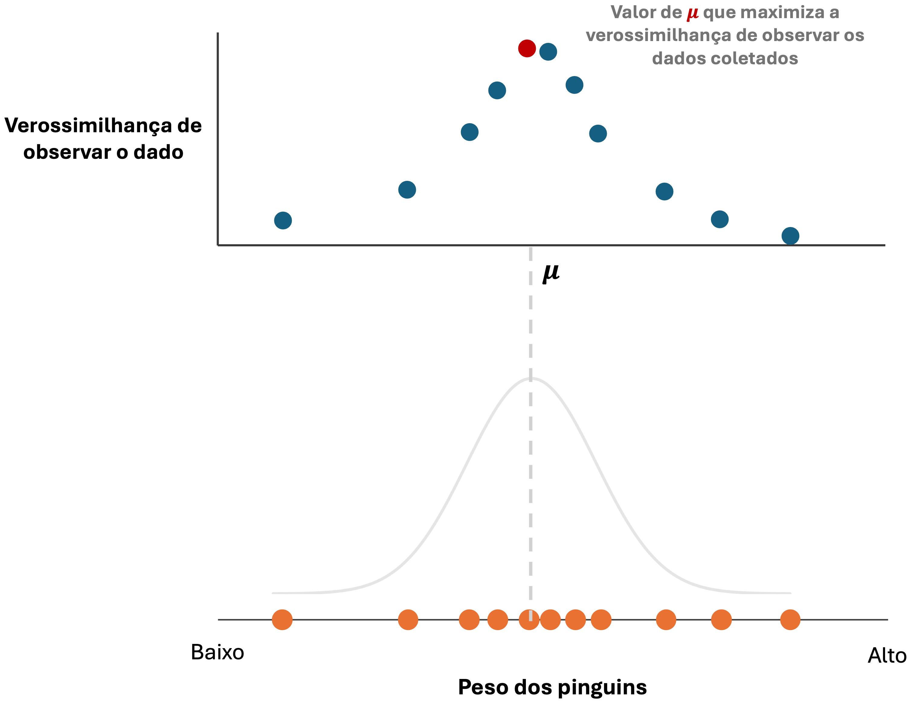
```
]
.pull-right[

<br>
<br>
<br>
<br>

$$\large \hat{\theta} := argmax ~ L(\theta)$$
]

---
### <span style="color: #ee6c4d;">**Métodos de inferência** </span><span style="color: #3e5c76;">| Máxima verossimilhança  </span> 


#### Confrontando os dados com a distribuição de probabilidade

Como a distribuição Normal é descrita por dois parâmetros ($\mu,\sigma^2$), é preciso achar o máximo da função de verossimilhança *simultaneamente* para ambos os parâmetros

.pull-left[

```{r echo=FALSE, out.width ="80%", fig.align ='center'}

```
]

.pull-right[

```{r echo=FALSE, out.width ="80%", fig.align ='center'}
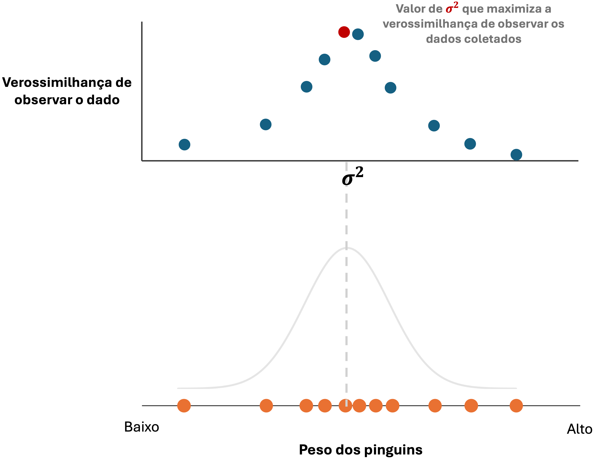
```
]

---
### <span style="color: #ee6c4d;">**Métodos de inferência** </span><span style="color: #3e5c76;">| Máxima verossimilhança  </span> 


#### Confrontando os dados com a distribuição de probabilidade


```{r, echo=F, message=F, warning=F}
set.seed(1)
y <- rnorm(1000, mean = 5, sd = 2)

# Common grid
mu_seq    <- seq(4.75,  5.15,  length.out = 100)
sigma_seq <- seq(1.95, 2.25, length.out = 100)

# Common log-likelihood function
loglik_normal <- function(mu, sigma, y) {
  if (sigma <= 0) return(NA_real_)
  sum(dnorm(y, mean = mu, sd = sigma, log = TRUE))
}

# Grid for contour
grid <- expand.grid(mu = mu_seq, sigma = sigma_seq)
grid$loglik <- mapply(loglik_normal, grid$mu, grid$sigma, MoreArgs = list(y = y))
grid$lik <- exp(grid$loglik - max(grid$loglik, na.rm = TRUE))

mu_hat    <- mean(y)
sigma_hat <- sqrt(mean((y - mu_hat)^2))
nll_hat   <- -loglik_normal(mu_hat, sigma_hat, y) # neg LL for 3D
```

.pull-left[
<br>

```{r, echo=F, message=F, warning=F,  fig.asp=0.9}
library(ggplot2)

ggplot(grid, aes(x = mu, y = sigma, z = lik)) +
  geom_contour_filled() +
  geom_vline(xintercept = mu_hat, color = "white", size = .4) +
  geom_hline(yintercept = sigma_hat, color = "white", size = .4) +
  scale_fill_viridis_d(option = "D", direction = 1) +
  labs(title = "Verossimilhança", x = expression(mu), y = expression(sigma^2), fill = NULL) +
  theme_minimal(base_size = 14) +
  theme(plot.title = element_text(hjust = 0.5, face='bold'))
```


]
.pull-right[
<br>

```{r,echo=F, message=F, warning=F, fig.asp=0.7, fig.align='left'}
library(plotly)

Z <- outer(mu_seq, sigma_seq, Vectorize(function(m, s) -loglik_normal(m, s, y)))


plot_ly(
  x = ~mu_seq, y = ~sigma_seq, z = ~t(Z)
) |>
  add_surface(showscale = FALSE, opacity = 0.8, reversescale = T) |>
  layout(scene = list(
    xaxis = list(title = "mu"),
    yaxis = list(title = "sigma"),
    zaxis = list(title = "Neg. log lik")
  )) |>
  add_markers(
    x = mu_hat, y = sigma_hat, z = nll_hat,
    marker = list(size = 6, symbol = "circle", opacity = 1),
    showlegend = FALSE) %>%
  layout(margin = list(t = 0, b = 20, l = 0, r = 0))


```


]


---

### <span style="color: #ee6c4d;">**Métodos de inferência** </span><span style="color: #3e5c76;">| Máxima verossimilhança  </span> 


#### Traduzindo para o matematiquês


<br>

$$\large L(\theta \mid y_1, \dots, y_n) = \prod_{i=1}^{n} f(y_i \mid \theta)$$
--

$$\large L(\theta \mid y_1, \dots, y_n) = f(y_1 \mid \theta) \cdot f(y_2 \mid \theta) \cdot f(y_3 \mid \theta) \cdots f(y_n \mid \theta)$$
<br>

--


**Quando** $\bf{n >>}$
- limitação computacional
    - truque matemático: aplicar o log!
    

---
### <span style="color: #ee6c4d;">**Métodos de inferência** </span><span style="color: #3e5c76;">| Máxima verossimilhança  </span> 


#### Traduzindo para o matematiquês

<br>

$$\large L(\theta \mid y_1, \dots, y_n) = \prod_{i=1}^{n} f(y_i \mid \theta)$$

--

Função de log-verossimilhança (*log-likelihood*)

$$\large \log L(\theta\mid y_1,\dots,y_n)
=\sum_{i=1}^n \log f(y_i\mid \theta)$$

--

- Tornando o produto em somatório implica em:
    - Estabilidade numérica e maior facilidade na diferenciação da função
    - O máximo da função torna-se o mínimo, i.e., $\hat{\theta} := argmin ~ L(\theta)$


---
### <span style="color: #ee6c4d;">**Métodos de inferência** </span><span style="color: #3e5c76;">| Máxima verossimilhança  </span> 


#### Verossimilhança perfilada (*profile likelihood*)

<br>

```{r echo=FALSE, out.width ="100%", fig.align ='center'}
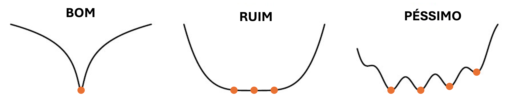
```

<p class="comment">
<b>ATENÇÃO</b>
<br>

A curvatura da função está relacionada à precisão do parâmetro estimado! 
</p>


---

### <span style="color: #ee6c4d;">**Métodos de inferência** </span><span style="color: #3e5c76;">| Máxima verossimilhança  </span> 


#### **Exemplo prático**

O histograma *parece* indicar que o peso dos pinguins, $y_i$, pode ser descrito conforme uma distribuição Normal (Gaussiana)

.pull-left[

```{r echo=FALSE, out.width ="100%", fig.align ='center'}
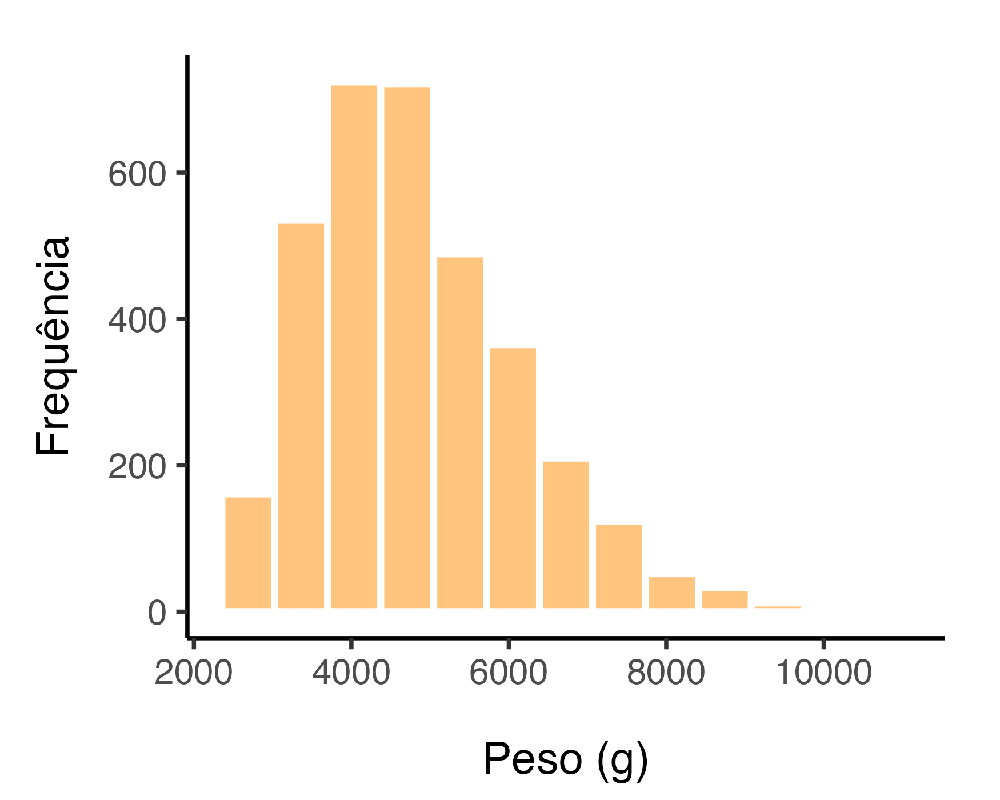
```

]

.pull-right[

<br>
<br>

$$\Large Y \sim N(\mu, \sigma^2)$$
<br>

> Como estimar os parâmetros? 

]

---
### <span style="color: #ee6c4d;">**Métodos de inferência** </span><span style="color: #3e5c76;">| Máxima verossimilhança  </span> 


#### **Exemplo prático**

Lembrando que a função de verossimilhança $L(\cdot)$ é descrita em relação ao modelo probabilístico que descreve a variável $f(Y|\theta)$

$$\large L(\theta \mid y_1, \dots, y_n) = \prod_{i=1}^{n} \color{Tomato}{f(y_i \mid \theta)}$$
--

Para a distribuição Normal, temos:


$$\large L(\mu, \sigma^2 \mid Y) = \prod_{i=1}^n \color{Tomato}{\frac{1}{\sqrt{2\pi\sigma^2}} 
\exp\left[ -\frac{(y_i - \mu)^2}{2\sigma^2} \right]}$$

--


---
### <span style="color: #ee6c4d;">**Métodos de inferência** </span><span style="color: #3e5c76;">| Máxima verossimilhança  </span> 


#### **Exemplo prático**

<br>
<br>

```{r echo=FALSE, out.width ="25%", fig.align ='center', fig.cap="Pratica_aula_02.R", fig.topcaption=F}
knitr::include_graphics("../Figuras/Rlogo.png")
```


---


---
### <span style="color: #ee6c4d;">**Métodos de inferência** </span><span style="color: #3e5c76;">| Máxima verossimilhança  </span> 


#### Exemplo prático


---
### <span style="color: #ee6c4d;">**Métodos de inferência** </span><span style="color: #3e5c76;">| Máxima verossimilhança  </span> 


<p class="comment">
<b>ATENÇÃO</b>
</p>

$$\large \text{Verossimilhança} \neq \text{Probabilidade}$$ 

--

.pull-left[

<center><span style="color: #ee6c4d;"><b> Verossimilhança </b></span> </center>

**O que é fixo:** os dados observados ($y$)

**O que é variável:** os parâmetros da distribuição ($\theta$)

**Raciocínio:** Dado as observações $y$, quão plausível são os diferentes valores dos parâmetros $\theta$?

] 

--

.pull-right[

<center><span style="color: #ee6c4d;"><b> Probabilidade </b></span> </center>

**O que é fixo:** os parâmetros da distribuição ($\theta$)

**O que é variável:** os dados observados ($y$)

**Raciocínio:** Dado que conheço os parâmetros $\theta$, qual a *probabilidade* de observar os dados $y$?

]


---