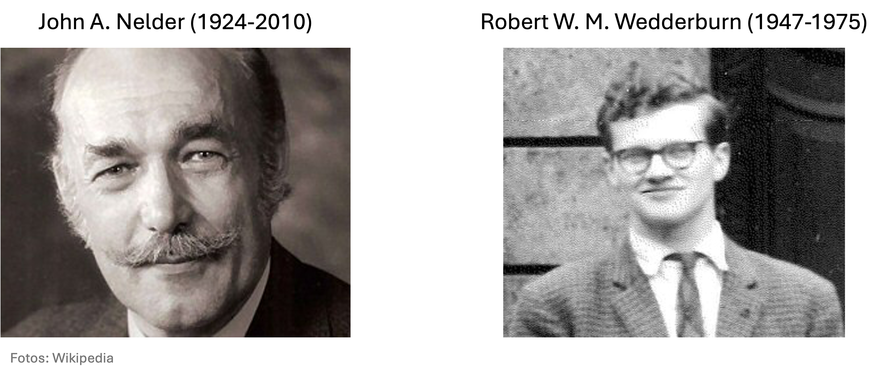
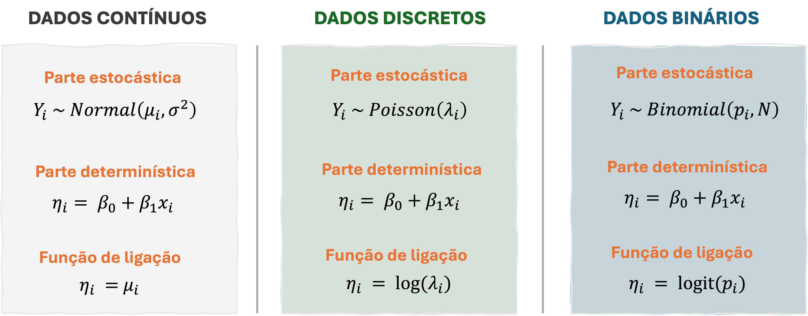
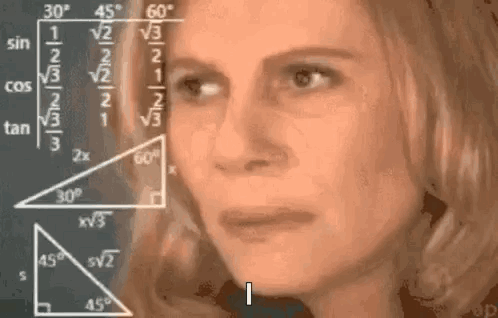
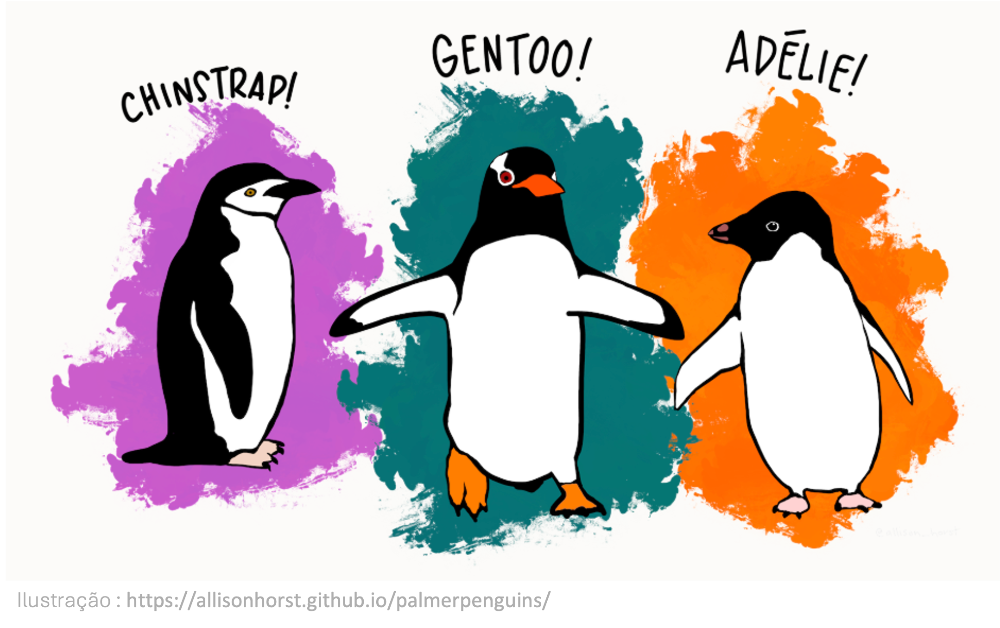
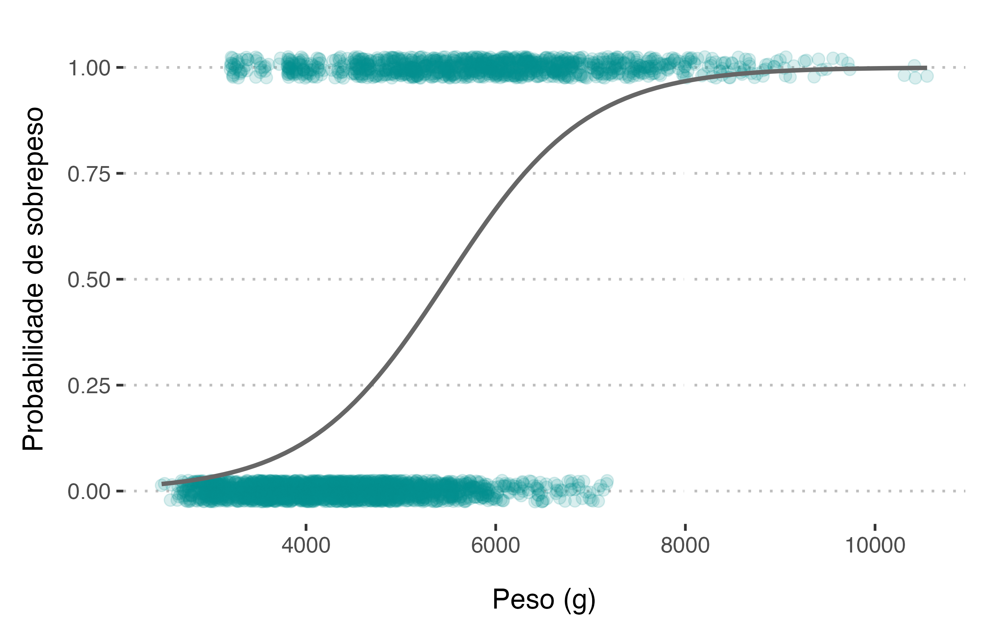
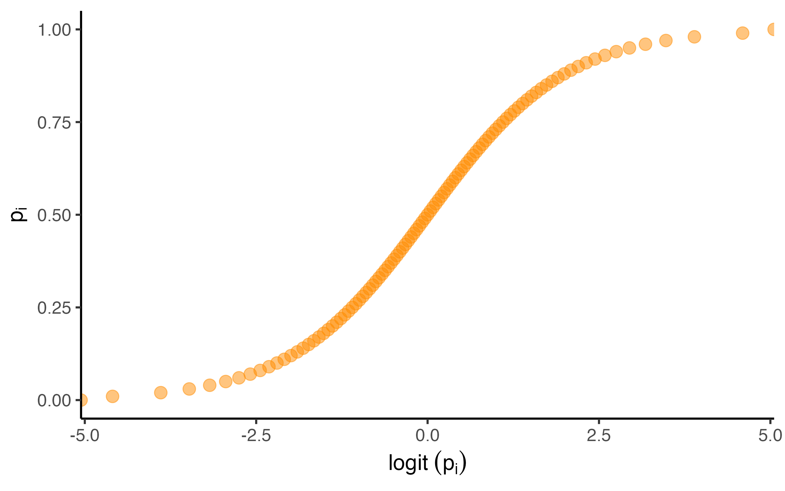

## <span style="color: #ee6c4d;">Conteúdo programático </span> 

<br>

**1. Desmistificando os GLMs**  

**2. GLM para dados binários**  


- Sugestão de leitura:
  - Caps. 2 & 3: Extending the Linear model with R (Faraway)
  - Caps. 8 & 9: Mixed effect models and extensions in Ecology (Zuur)
  - Cap. 13: regression and other stories (Gelman)
  -

---
class: inverse, center, middle

# Desmistificando os GLMs

---
## <span style="color: #ee6c4d;">Desmistificando os GLMs </span> 

Nem tudo na natureza segue uma distribuição Normal...


> A maioria dos processos ecológicos gera dados assimétricos, discretos e que violam um ou mais dos pressupostos do modelo linear


---


## <span style="color: #ee6c4d;">Desmistificando os GLMs </span> 

Formalização dos GLMs em 1972 por Nelder & Wedderburn<sup>1</sup>

<br>

```{r echo=FALSE, out.width ="80%", fig.align ='center'}

```
<br>

.footnote[<sup>1</sup> [Nelder & Wedderburn. 1972. Generalized Linear Models.](https://doi.org/10.2307/2344614)]


---
## <span style="color: #ee6c4d;">Desmistificando os GLMs </span> 


.pull-left[

**Modelo linear (LM)**

<br>

$$y_i \sim N(\mu_i, \sigma^2)$$


$$\mu_i = \beta_0 + \sum_{j=1}^{p} \beta_j x_{ij}$$
]

--

.pull-right[

**Modelo linear *generalizado* (GLM)**

<br>


$$y_i \sim  {\color{Tomato}F}(\mu_i,  {\color{Tomato}\phi})$$

$$\color{Tomato}{g(\mu_i)} = \color{Tomato}{\eta_i} = \beta_0 + \sum_{j=1}^{p} \beta_j x_{ij} + \varepsilon_i$$

]

<br>
--

<p class="comment">
<b>ATENÇÃO</b>
<br>
  
O GLM estende o LM ao permitir que a variável resposta siga uma distribuição de probabilidade outra que a distribuição Normal  
</p>

---
## <span style="color: #ee6c4d;">Desmistificando os GLMs </span>

Os GLMs evitam o velho hábito de transformar os dados


.pull-left[

<br>

> <font size="6"><center> <span style="color: #ee6c4d;">If you torture the data long enough, it will confess to anything</center></font></span> 

]

.pull-right[

```{r echo=FALSE, out.width ="50%", fig.align ='center', fig.cap="Ronald Coase (1910-2013)", fig.topcaption=T}

```


]


---
## <span style="color: #ee6c4d;">Desmistificando os GLMs </span><span style="color: #3e5c76;">| Visão geral  </span>  

Os GLMs são compostos por 3 componentes:

.pull-left[

<br>
<br>

$$y_i \sim  {\color{Tomato}F}(\mu_i,  \phi)$$

$$\color{Tomato}{g(\mu_i)} = \color{Tomato}{\eta_i} = \beta_0 + \sum_{j=1}^{p} \beta_j x_{ij} + \varepsilon_i$$

]

.pull-right[

<br>
<br>


**1. $F(\cdot)$ -** Distribuição de probabilidade para variável resposta 

**2. $\eta_i$ -** Preditor linear 

**3. $g(\mu_i)$ -** Função de ligação

]


---

## <span style="color: #ee6c4d;">Desmistificando os GLMs </span><span style="color: #3e5c76;">| Visão geral  </span>  

Os GLMs são compostos por 3 componentes:

- <span style="color: #ee6c4d;"><b>`1º componente:`</b></span> Distribuição de probabilidade para variável resposta


<br>

$$\large y_i \sim  {\color{Tomato}F}(\mu_i,  \phi)$$
  
  - Componente *aleatório* do modelo

--

  - $F(\cdot)$ pertence à família exponencial
  
    - A variância dos dados $Var(y_i)$ é descrita em função do parâmetro de sobredispersão $\phi$ conforme: $\text{Var}(y_i) = \phi \text{V}(\mu_i)$

--

   > <span style="color: #ee6c4d;">Permite relaxar o pressuposto de homocedasticidade (i.e., a variância pode variar com a média)</span>


---
## <span style="color: #ee6c4d;">Desmistificando os GLMs </span><span style="color: #3e5c76;">| Visão geral  </span>  

Os GLMs são compostos por 3 componentes:

- <span style="color: #ee6c4d;"><b>`1º componente:`</b></span> Distribuição de probabilidade para variável resposta

  - **A família exponencial de distribuições** 
     - Cobre uma diversidade de distribuições de probabilidade
          - Específico à natureza da variável $y_i$
  

---
## <span style="color: #ee6c4d;">Desmistificando os GLMs </span><span style="color: #3e5c76;">| Visão geral  </span>  

Os GLMs são compostos por 3 componentes:

- <span style="color: #ee6c4d;"><b>`1º componente:`</b></span> Distribuição de probabilidade para variável resposta


```{r echo=FALSE, out.width ="100%", fig.align ='center'}

```

---
## <span style="color: #ee6c4d;">Desmistificando os GLMs </span><span style="color: #3e5c76;">| Visão geral  </span>  

Os GLMs são compostos por 3 componentes:

- <span style="color: #ee6c4d;"><b>`1º componente:`</b></span> Distribuição de probabilidade para variável resposta

  **Todas as distribuições de probabilidades são descritas pelos seus *momentos***
  - Descrevem numericamente as características da distribuição (e.g., média, variância, assimetria e curtose)

--

      - **1º momento (média):** $~~~ \mu'_1 = E[Y]$
      - **2º momento (variância):** $~~~ \mu_2 = E[(Y - E[Y])^2]$
      - **3º momento (assimetria):** $~~~ \mu_3 = E[(Y - E[Y])^3]$
      - **4º momento (curtose):** $~~~ \mu_4 = E[(Y - E[Y])^4]$


---
## <span style="color: #ee6c4d;">Desmistificando os GLMs </span><span style="color: #3e5c76;">| Visão geral  </span>  

Os GLMs são compostos por 3 componentes:

  **Todas as distribuições de probabilidades são descritas pelos seus *momentos***
  
<br>

| **Distribuição** | **Parâmetros**  | **Média (1º momento)** | **Variância (2º momento)**         |
| ---------------- | --------------- | ---------------------- | ---------------------------------- |
| **Normal**       | $\mu, \sigma^2$ | $E[Y] = \mu$           | $Var(Y) = \sigma^2 = E[(Y-\mu)^2]$ |
| **Binomial**     | $n, p$          | $E[Y] = np$      | $Var(Y) = np(1-p) = E[(Y-\mu)^2]$  |
| **Poisson**      | $\lambda$       | $E[Y] = \lambda$ | $Var(Y) = \lambda = E[(Y-\mu)^2]$  |

---
## <span style="color: #ee6c4d;">Desmistificando os GLMs </span><span style="color: #3e5c76;">| Visão geral  </span>  

Os GLMs são compostos por 3 componentes:

- <span style="color: #ee6c4d;"><b>`1º componente:`</b></span> Distribuição de probabilidade para variável resposta

  Há muitas outras distribuições que fazem parte da família exponencial, entre elas:

.pull-left[
    - **Dados contínuos**
      - log-Normal
      - Gama
      - Exponencial
      - Qui-quadrado
]

.pull-right[
  - **Dados discretos**
    - Bernoulli / Binomial
    - Poisson
    - Binomial Negativa
    - Multionomial
]

<br>

[Outros exemplos](https://www.math.wm.edu/~leemis/chart/UDR/UDR.html) </center>

---
## <span style="color: #ee6c4d;">Desmistificando os GLMs </span><span style="color: #3e5c76;">| Visão geral  </span>  

Os GLMs são compostos por 3 componentes:

- <span style="color: #ee6c4d;"><b>`2º componente:`</b></span> Preditor linear

- Componente *sistemático* do modelo


$$\color{Tomato}{\eta_i} = \beta_0 + \sum_{j=1}^{p} \beta_j x_{ij}$$

- Modelo que estabelece a relação entre y-x


---
## <span style="color: #ee6c4d;">Desmistificando os GLMs </span><span style="color: #3e5c76;">| Visão geral  </span>  

Os GLMs são compostos por 3 componentes:

- <span style="color: #ee6c4d;"><b>`3º componente:`</b></span> função de ligação


- Estabelece a ligação entre o preditor linear $\eta_i$ e a média da distribuição $\mu_i$ (variável resposta) 
  - liga o componente aleatório ao sistemático


$$\color{Tomato}{g(\mu_i)} = \eta_i$$
- Garante que os valores de $\eta_i$ esteja dentro dos valores de $\mu_i$

--

    - não há restrições sobre os valores de $\eta_i$: $~~~~  -\infty < \eta_i < +\infty$
--
    - há restrições sobre os valores de $\mu_i$:
--
       - $\mu > 0$: contagem de espécies (distribução Poisson)
--
       - $0 < \mu < 1$: presença/ausência de espécies (distribução Binomial)
--
       - $\mu > 0$: biomassa (distribuição Gama)

---

## <span style="color: #ee6c4d;">Desmistificando os GLMs </span><span style="color: #3e5c76;">| Pressupostos  </span>  


Assim como nos modelos lineares, os GLMs devem atender aos pressupostso de:

- **Representatividade**
  - As amostras são representativas da população
  - "*Garbage in, garbage out*"


- **Aditividade & Linearidade**
  - O modelo é aditivo e linear na relação de seus parâmetros


Além disso:

- **Escolha do modelo**
  - A escolha da distribuição de probabiliadade (modelo) deve ser condizente com a natureza da variável resposta
---
## <span style="color: #ee6c4d;">Desmistificando os GLMs </span><span style="color: #3e5c76;">| Pressupostos  </span>  

Com os resíduos, a história é diferente

.pull-left[
- **Resíduos**
  - Independentes 
  - ~~Homocedásticos (variância constante)~~
  - ~~Normalidade~~
]

.pull-right[

```{r echo=FALSE, out.width ="60%", fig.align ='center'}

```
]

--

- a heterocedasticidade já faz parte dos GLMs
    - Variância é descrita em função da média $(Var(y_i) = \phi V(\mu_i))$
    
    
- a normalidade residual só se aplica para o caso em que a variável resposta ($y$) segue uma distribuição Normal de probabilidae
  - os resíduos podem ser avaliaados sob o prisma do modelo de probabilidade escolhido para a variável $y$ 

---
## <span style="color: #ee6c4d;">Desmistificando os GLMs </span><span style="color: #3e5c76;">| Pressupostos  </span>  

#### Análise residual via pacote `DHARMa`


- Analisa resíduos *simulados* ($y_{i,\text{sim}}$)
  - e não resíduos tradicionais ($y_i -\hat{y_i}$)

--


**Como funciona:**

1. Usa o modelo ajustado para simular muitos conjuntos de dados que poderiam ter acontecido de acordo com a distribuição do modelo
  - Exemplo: Binomial, Poisson, ....

--

2. Cada valor observado ($y_i$) é contrastado com o valor simulado  ($y_{i,\text{sim}}$)
  - A difrerença entre esses valores é convertida em percentil (0-1)
    - Se o modelo for bom, todos os valores observados devem estar distribuídos uniformemente entre 0 e 1 - **QQ-plot**

 

---

class: inverse, center, middle

# GLM para dados binários

---

## <span style="color: #ee6c4d;">Dados binários </span>

Tipo de informação que só pode assumir dois estados possíveis:

<br>


```{r echo=FALSE, out.width ="100%", fig.align ='center'}

```


---

## <span style="color: #ee6c4d;">Exemplo prático </span>

Os dados de pinguins de Palmer contém a informação sobre o estado de saúde dos indivíduos amostrados:
  - Cada indivíduo é classificado em **sobrepeso** vs. **saudável** com base na sua massa corporal

  > **Pergunta:** A incidência de sobrepeso difere entre as espécies?


.pull-left[

<br>
```{r echo=FALSE, out.width ="70%", fig.align ='center'}

```
]

.pull-right[

```{r echo=FALSE, out.width ="the 80%", fig.align ='left'}

```
]


---


## <span style="color: #ee6c4d;">Dados binários </span>

#### Traduzindo para o matematiquês

Dados com características binárias são típicamente descritos por uma **distribuição Binomial (Bernoulli)** 


$$\large y_i = 
\begin{cases}
1 ~~~ \text{se verdadeiro (sobpreseo)} \\
0 ~~~ \text{se falso (saudável)}
\end{cases}$$

<br>

--

$$\large y_i \sim Bernoulli(p_i)$$
- $\large y_i$: estado do indivíduo (sobrepeso/saudável)
- $\large p_i$: probabilidade de verdadeiro (sobrepeso)


---
## <span style="color: #ee6c4d;">Dados binários </span>

#### Traduzindo para o matematiquês

Quando se observa mais de um indivíduo:

$$\large y_i \sim Binomial(n_i, p_i)$$

**Média:** $E[Y] = \mu = np$

**Variância:** $E[(Y-\mu)^2] = Var(Y) = np(1-p)$

- $\large y_i$: numero de indivíduos na categoria *verdadeiro* (sobrepeso)
- $\large n_i$: número total de indivíduos
- $\large p_i$: probabilidade de sucesso (sobrepeso)

--

<p class="comment">
<b>ATENÇÃO</b>
<br>
  
A Bernoulli é um caso especial da Binomial quando $n_i = 1$
</p>

---
## <span style="color: #ee6c4d;">Dados binários </span>

#### Traduzindo para o matematiquês

Quando se observa mais de um indivíduo:

$$\large y_i \sim Binomial(n_i, p_i)$$

Podemos relacionar a probabilidade de sucesso a um conjunto de covariáveis, conforme:

$$\large logit(p_i) = \eta_i = \beta_0 +\sum_{j=1}^{p} \beta_j x_{ij}$$


  > No exemplo dos pinguins, é razoável supor que a probabilidade de sobrepeso varie não apenas em função do estágio de desenvolvimento (filhote, juvenil, adulto), como também da espécie considerada (Adelie, Chinstrap, Gentoo)
  

---
## <span style="color: #ee6c4d;">Dados binários </span>

#### Traduzindo para o matematiquês

Na distribuição Binomial, a função de ligação é frequentemente descrita pela **função logit**:

$$\large logit(p_i) = log(\frac{p_i}{1-p_i}) $$

---
## <span style="color: #ee6c4d;">Dados binários </span>

#### Traduzindo para o matematiquês

Na distribuição Binomial, a função de ligação é frequentemente descrita pela **função logit**:

$$\large logit(p_i) = log(\color{Tomato}{\underbrace{\frac{p_i}{1-p_i}}_\text{razão de chances (odds)}})$$

- A razão de chances representa quantas vezes é mais provável ocorrer sucesso do que fracasso

--

  - **Por exemplo:** Se $p_i = 0.8$, então
      - $\text{odds} = \frac{0.8}{1-0.8} = 4$ (O sucesso é 4x mais proável que o fracasso!)


---
## <span style="color: #ee6c4d;">Dados binários </span>

#### Traduzindo para o matematiquês

Na distribuição Binomial, a função de ligação é frequentemente descrita pela **função logit**:

$$\large logit(p_i) = log(\color{Tomato}{\underbrace{\frac{p_i}{1-p_i}}_\text{razão de chances (odds)}})$$

- Tiramos o logaritmo da razão de chances (odds), porque isso permite transformar os valores para a escala real ($-\infty$, $+\infty$)
  - Alinhando com os valores do preditor linear $\eta_i$ e vice-versa


---

## <span style="color: #ee6c4d;">Dados binários </span>

#### Traduzindo para o matematiquês

Vejamos como funciona essa transformação:


.pull-left[

<br>
<br>

$$\large logit(p_i) = log(\frac{p_i}{1-p_i}) $$


]

.pull-right[
|  pi | logit(pi) |
|:---:|:---------:|
|  0  |    -Inf   |
| 0.1 |   -2.197  |
| 0.3 |   -0.847  |
| 0.5 |     0     |
| 0.8 |   1.386   |
|  1  |    +Inf   |
]

---
## <span style="color: #ee6c4d;">Dados binários </span>

#### Traduzindo para o matematiquês

Quando transformamos infinitos valores de $p_i$, obtemos a característica curva sigmóide

<br>

```{r echo=FALSE, out.width ="60%", fig.align ='center'}

```


---
## <span style="color: #ee6c4d;">Dados binários </span>

#### Traduzindo para o matematiquês

Por causa da função de ligação, mudamos a forma como interpretamos os parâmetros do modelo


$$
log(\frac{p_i}{1-p_i}) = \beta_0 + \beta_1x_i
$$
- Se deixarmos na escala da função de ligação, interpretamos os resultados na escala log

  - $\beta_1:$ efeito do aumento de uma unidade de $x$ sobre o *logaritmo* da razão de chances (log-odds)
      - Se $\beta_1 > 0:$ aumento do log-odds à medida que aumentamos $x$ 
      - Se $\beta_1 < 0:$ diminui o log-odds à medida que aumentamos $x$ 


---
## <span style="color: #ee6c4d;">Dados binários </span>

#### Traduzindo para o matematiquês

Em GLMs, muitas vezes é mais conveniente aplicar a função inversa para interpretar os parâmetros na escala original
  - No caso da distribuição Binomial, $\text{log} \leftrightarrow \text{exp}$
  
--

  - Assim, teremos:
  $$\frac{p_i}{1-p_i} = e^{\beta_0 + \beta_1x_i}$$
  
  Interpretamos $\beta_1$ como: para cada aumento de 1 unidade em $x$, as chances do evento ocorrer são multiplicadas por $e^{\beta_1}$
    - Se $\beta_1 = 0.7$, então $e^{0.7}  \approx 2.01$
      - Cada aumento de uma unidade em x dobra as chances do evento ocorrer
  

---
## <span style="color: #ee6c4d;">Dados binários </span>

#### Traduzindo para o matematiquês

Em modelos com distribuição binomial, a função de ligação logit é a mais amplamente utilizada
  - Há outras funções de ligações que podem ser testadas:
    - probit
    - cloglog
    - cauchit

--

  - Pode-se testar o mesmo modelo usando funções de ligações diferentes

<p class="comment">
<b>ATENÇÃO</b>
<br>
  
A comparação entre os modelos não pode ser feita mediante o teste de razão de verossimilhança (LRT), porque os modelos não são aninhados! 
</p>

---
## <span style="color: #ee6c4d;">Exemplo prático </span>


<br>
<br>

```{r echo=FALSE, out.width ="25%", fig.align ='center', fig.cap="Pratica_aula_03.R <br> (Relatorio/01-GLM_binario.Rmd)", fig.topcaption=F}

```

