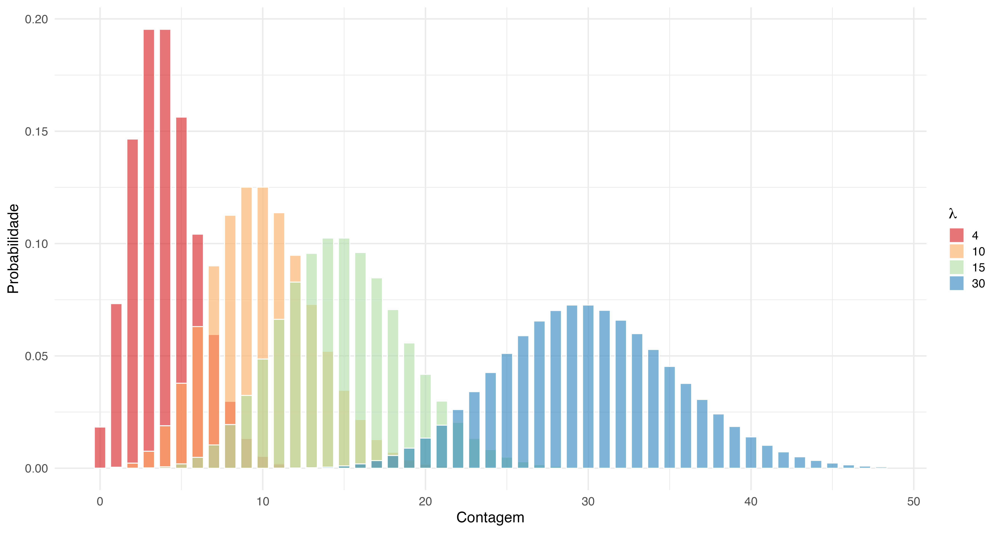
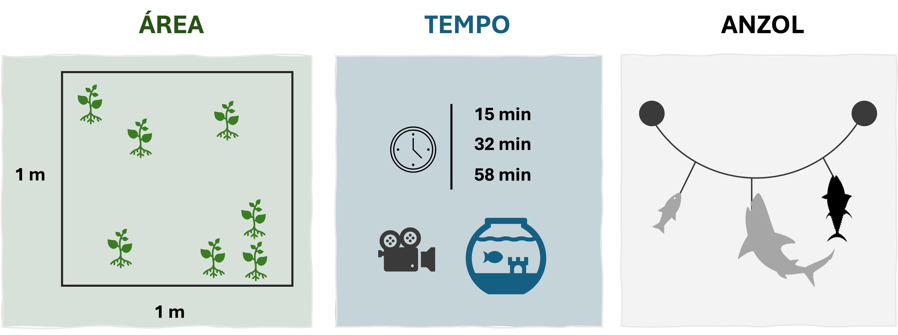
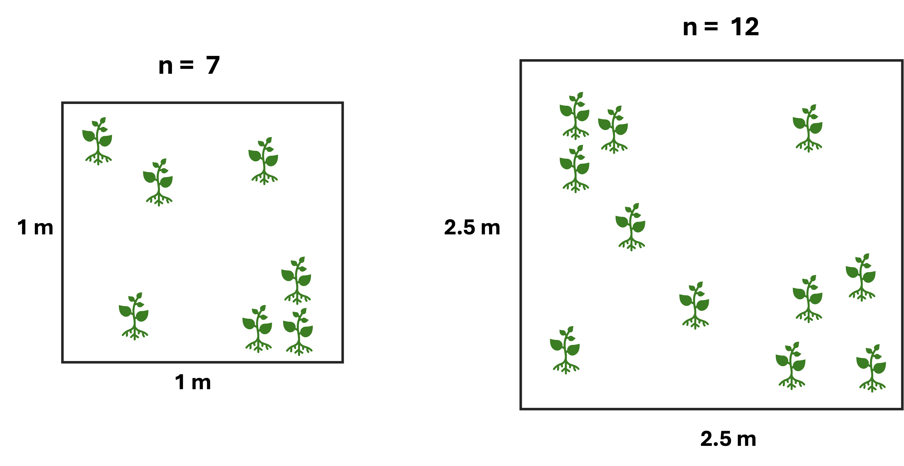
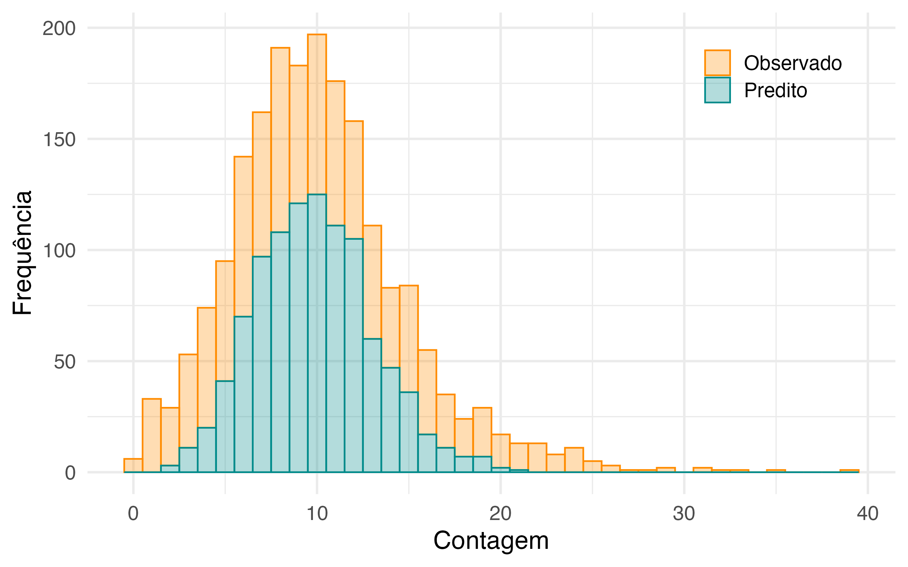
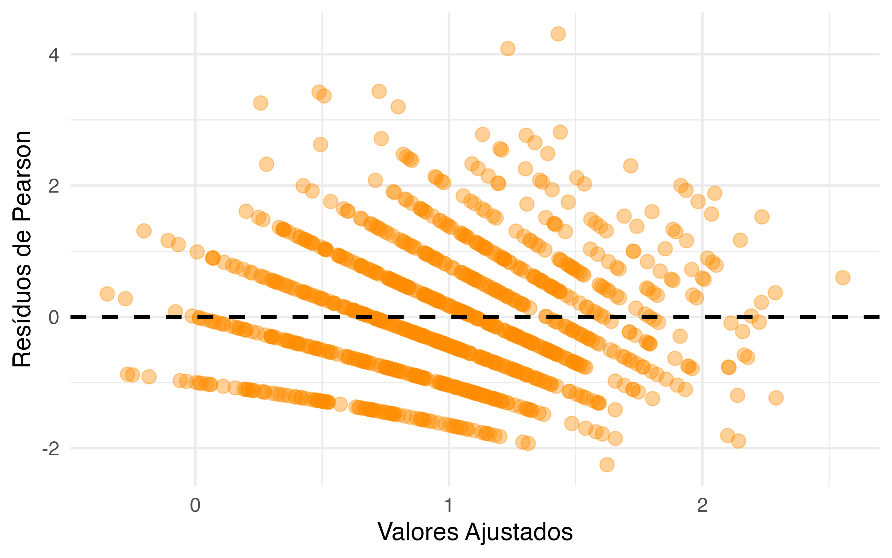
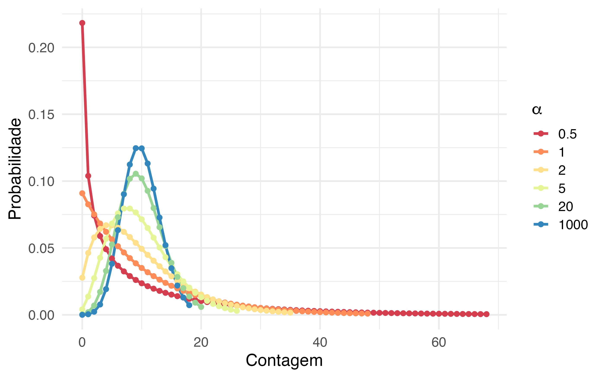

## <span style="color: #ee6c4d;">Conteúdo programático </span> 

<br>


**1. O que é um dado discreto?**  


**2. Distribuição Poisson**  


**3. Distribuição Binomial Negativa**  


- Sugestão de leitura:
  - Cap. 5: Extending the Linear model with R (Faraway)
  - Cap. 9: Mixed effect models and extensions in Ecology (Zuur)


---
class: inverse, center, middle

# O que é um dado discreto?

---
## <span style="color: #ee6c4d;">Dados discretos </span>


Tipo de informação que assume apenas valores inteiros e contáveis
  - Número de ocorrência que um determinado evento ocorre no tempo  

<br>


```{r echo=FALSE, out.width ="100%", fig.align ='center'}

```


---
## <span style="color: #ee6c4d;">Exemplo prático </span>

A pesca atuneira resulta muitas vezes na captura incidental de espécies não-alvo
  - Em cada evento de pesca (pescaria) são registrados as espécies que foram capturadas (além de muitas outras informações....)
  
    > **Pergunta:** A captura incidental de espécies não-alvo muda ao longo do ano?


```{r echo=FALSE, out.width ="90%", fig.align ='center'}
knitr::include_graphics("../Figuras/Longline_fisheries.png")
```

---
class: inverse, center, middle

# Distribuição Poisson

---
## <span style="color: #ee6c4d;">Distribuição Poisson </span>

#### Traduzindo para o matematiquês

Dados de contagem são frequentemente modelados via uma **distribuição Poisson** 


$$\large y_i \sim Poisson(\lambda_i) ~~~ (\lambda_i  \geq 0)$$

$$E[Y] = \lambda, ~~~~~Var(Y) = \lambda$$


$\large \lambda_i$: numéro médio de eventos (e.g., número médio de espécies não-alvo por pescaria)


<br>

--

<p class="comment">
<b>ATENÇÃO</b>
<br>

Assume que a média = variância! 
</p>


---
## <span style="color: #ee6c4d;">Distribuição Poisson </span>


#### Traduzindo para o matematiquês

A distribuição Poisson pode assumir vários formatos


```{r echo=FALSE, out.width ="75%", fig.align ='center'}

```

---

## <span style="color: #ee6c4d;">Distribuição Poisson </span>

#### Traduzindo para o matematiquês

Podemos relacionar a média de eventos $\lambda_i$ a um conjunto de covariáveis conforme a relação:


.pull-left[
<br>

$$\large y_i \sim Poisson(\lambda_i)$$

$$\large log(\lambda_i) = \eta_i$$
$$\large \eta_i = \beta_0 + \beta_1x_{i_1} + \beta_2x_{i_2} + \dots + \beta_px_{i_p}$$
]
.pull-right[


<p class="comment">
<b>ATENÇÃO</b>
<br>

Usamos a <i>função logarítmica</i> como função de ligação de forma que $\lambda \geq 0$

</p>

]


---

## <span style="color: #ee6c4d;">Distribuição Poisson </span><span style="color: #3e5c76;">| Offset </span> 

Dados de contagem muitas vezes são medidos em relação a uma referência, como uma área ou um período de tempo


```{r echo=FALSE, out.width ="100%", fig.align ='center'}

```

---
## <span style="color: #ee6c4d;">Distribuição Poisson </span><span style="color: #3e5c76;">| Offset </span> 

Se a referência não for padronizada ao longo do estudo, teremos conclusões equivocadas 


```{r echo=FALSE, out.width ="80%", fig.align ='center'}

```


---

## <span style="color: #ee6c4d;">Distribuição Poisson </span><span style="color: #3e5c76;">| Offset </span> 


É necessário padronizar a variável resposta

--

- Dividindo Y pelo *esforço amostral* (densidade)
  - E.g.: $\text{No. de plântulas}/m^2$
      - Variável contínua -> distribuição Normal, Gama, ....


--

<br>

- Contabilizando diretamente no modelo
  - **Offset**

---
## <span style="color: #ee6c4d;">Distribuição Poisson </span><span style="color: #3e5c76;">| Offset </span> 

#### Traduzindo para o matematiquês


O offset é uma variável preditora especial que entra no componente sistemático do modelo, porém não tem parâmetro para ser estimado

<br>

$$\large y_i \sim Poisson(\lambda_i\color{Tomato}{E_i})$$

--


$$\large log(\lambda_i\color{Tomato}{E_i}) = log(\lambda_i) + log(\color{Tomato}{E_i})$$

--

$$\large \beta_0 + \beta_1x_{i_1} + \beta_2x_{i_2} + \dots + \beta_px_{i_p}+ log(\color{Tomato}{E})$$
<br>

- Lembrando que $log(\lambda) = \eta$
- $E_i$ é a exposição (esforço amostral)


---

## <span style="color: #ee6c4d;">Distribuição Poisson </span><span style="color: #3e5c76;">| Sobredispersão </span> 

Dados discretos frequentemente apresentam sobredispersão
- $\text{Var(dados)} > \text{Var(modelo)}$


```{r echo=FALSE, out.width ="70%", fig.align ='center'}

```

---


## <span style="color: #ee6c4d;">Distribuição Poisson </span><span style="color: #3e5c76;">| Sobredispersão </span> 


.pull-left[
**Causa:**
  - Omissão de variáveis preditoras importantes
  
  - Dados zero-inflacionados
  
  - Dependência entre as observações

]


---
## <span style="color: #ee6c4d;">Distribuição Poisson </span><span style="color: #3e5c76;">| Sobredispersão </span> 


.pull-left[
**Causa:**
  - Omissão de variáveis preditoras importantes
  
  - Dados zero-inflacionados
  
  - Dependência entre as observações


-------

**Consequência:**
  - Erros padrões inflacionados (subestimação da variabilidade)
  
  - Significância estatística equivocada

]


---
## <span style="color: #ee6c4d;">Distribuição Poisson </span><span style="color: #3e5c76;">| Sobredispersão </span> 


.pull-left[
**Causa:**
  - Omissão de variáveis preditoras importantes
  
  - Dados zero-inflacionados
  
  - Dependência entre as observações


-------

**Consequência:**
  - Erros padrões inflacionados (subestimação da variabilidade)
  
  - Significância estatística equivocada

]


.pull-right[
<br>

**Solução:**
  - Incluir novas variáveis preditoras
  
  - Modelo quasi-Poisson (desuso)
  
  - Modelo Poisson com efeito(s) aleatório(s)
  
  - Modelo Binomial Negativo
  
  - Modelo Poisson/BN zero-inflacionado
]


---
## <span style="color: #ee6c4d;">Distribuição Poisson </span><span style="color: #3e5c76;">| Sobredispersão </span> 

**Detectando sobredispersão**


- Análise gráfica dos resíduos:

.pull-left[
```{r echo=FALSE, out.width ="100%", fig.align ='center'}

```

]


.pull-right[

Em GLMs, passamos a analisar os resíduos padronizados

- E.g.: **Resíduos de Pearson**

    $r_i = \frac{y_i-\hat{\lambda_i}}{\sqrt{\hat{\lambda_i}}}$


Espera-se que a média dos resíduos seja próxima de 0 e a variância próxima de 1!

]

---

## <span style="color: #ee6c4d;">Distribuição Poisson </span><span style="color: #3e5c76;">| Sobredispersão </span> 

**Detectando sobredispersão**


- Teste de razão de dispersão:
  - Calcula o fator de dispersão ($\phi$) - o quanto a variância residual desvia do modelo Poisson 


$$\large \phi = \frac{\chi^2}{df}= \frac{\sum_{i=1}^{n} \frac{(y_i-\hat{\lambda_i)^2}}{\hat{\lambda_i}}}{n-p} $$
- onde:
  - $y_i$ = valores observados
  - $\hat{\lambda_i}$ = valores preditos
  - $n$ = número de observações
  - $p$ = número de parâmetros no modelo
  - $\chi^2$ = qui-quadrado (soma dos resíduos de Pearson ao quadrado)
  
---
## <span style="color: #ee6c4d;">Distribuição Poisson </span><span style="color: #3e5c76;">| Sobredispersão </span> 

**Detectando sobredispersão**


- Teste de razão de dispersão:
  - Calcula o fator de dispersão ($\phi$) - o quanto a variância residual desvia do modelo Poisson 
  <br>
  
      - $\mathbf{\phi \approx 1}$: não há evidência de sobredispersão
      - $\mathbf{\phi > 1}$: sobredispersão (o modelo subestima a variância)
      - $\mathbf{\phi < 1}$: subdispersão (raro!)


---
class: inverse, center, middle

# Distribuição Binomial Negativa

---

## <span style="color: #ee6c4d;">Distribuição Binomial Negativa </span>

Alternativa quando os dados apresentam sobredispersão
- É uma extensão da distribuição Poisson


$$\large Y \sim Poisson(\color{Tomato}\lambda)$$

$$\large \color{Tomato}\lambda \sim Gama(\alpha, \beta)$$


A média da distribuição Poisson ($\lambda$) não é mais assumida como fixa
  - variável aleatória que segue uma distribuição Gama
  
$$E[Y] = \frac{\alpha}{\beta} = \mu, ~~~~~Var(Y) = \mu + \frac{\mu^2}{\alpha}$$


---
## <span style="color: #ee6c4d;">Distribuição Binomial Negativa </span>

Podemos resumir o modelo conforme


$$\large Y \sim BN(\mu, \alpha)$$

$$E[Y] = \mu, ~~~~~Var(Y) = \mu + \frac{\mu^2}{\alpha}$$

onde:
- $\mu$: média da distribuição BN
- $\alpha$: parâmetro de dispersão (forma/*shape*)

--


<p class="comment">
<b>ATENÇÃO</b>
<br>

O que significa quando $\alpha \rightarrow \infty$?

</p>

---
## <span style="color: #ee6c4d;">Distribuição Binomial Negativa </span>

<br>

```{r echo=FALSE, out.width ="80%", fig.align ='center'}

```


---