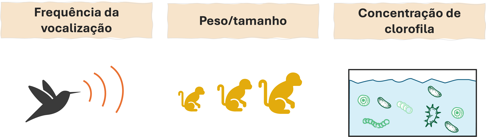
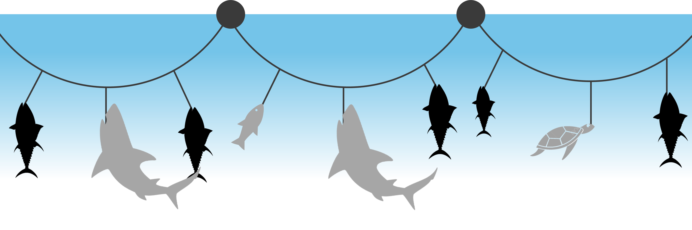
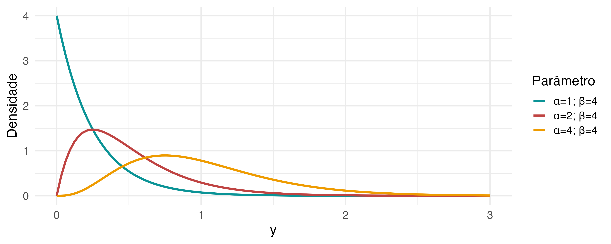
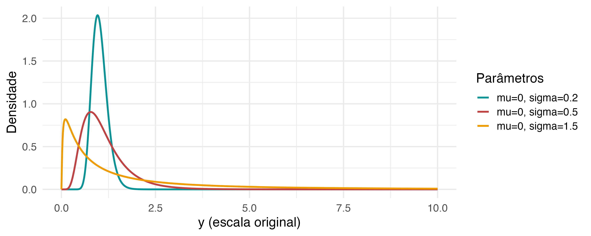

## <span style="color: #ee6c4d;">Conteúdo programático </span> 

<br>


**1. O que é um dado contínuo?**  


**2. Distribuição Gamma**  


**3. Distribuição log-Normal**  

  > Prática 

---

## <span style="color: #ee6c4d;">Leitura sugerida </span> 


**Livros**
- **Cap. 8:** Zuur et al. (2009)
- **Cap. 4 (seção 4.6):** Bolker (2008)
- **Cap. 9 (seção 9.1):** Faraway (2016)


---
class: inverse, center, middle

# O que é um dado contínuo?

---
## <span style="color: #ee6c4d;">Dados contínuos </span>


Tipo de informação que assume um número infinito de valores dentro de um intervalo
  - Número fracionário (e.g., 1.59, 310.89, 0.034, ...)  


```{r echo=FALSE, out.width ="100%", fig.align ='center'}

```


---
## <span style="color: #ee6c4d;">Dados contínuos </span>


Distribuições de probabilidade contínuas:

- Gaussiana (Normal)
- log-Gaussiana
- Gama
- Exponencial
- Qui-Quadrado
- Student
- Uniforme*
- Beta*
- Weibull*


.footnote[*Não pertence à família exponencial de distribuições]


---
## <span style="color: #ee6c4d;">Exemplo prático </span>

A captura incidental de espécies não-alvo, i.e. *bycatch*, ocorre com frequência na pesca de espinhel.
  - Entender padrões espaço-temporais do bycatch é fundamental para propor medidas de manejo pesqueiro, 
  
    > **Pergunta:** Em que época do ano são registrados as maiores capturas de bycatch? Espacialmente, há uma área mais vulnerável?


```{r echo=FALSE, out.width ="90%", fig.align ='center'}

```


---

class: inverse, center, middle

# Distribuição Gama

---

## <span style="color: #ee6c4d;">Distribuição Gama </span>

Definida sob variáveis contínuas estritamente positivas

$$\large f(y; \alpha, \beta) = \frac{\beta^{\alpha} y^{\alpha - 1} e^{-\beta y}}{\Gamma(\alpha)}, \quad y > 0$$

```{r echo=FALSE, out.width ="85%", fig.align ='center'}

```

---

## <span style="color: #ee6c4d;">Distribuição Gama </span><span style="color: #3e5c76;">| Exercício </span> 

<br>

```{r echo=T, eval = FALSE}

# Criando uma sequência de y
y <- seq(0, 3, length.out = 100)

## Variando alpha
plot(dgamma(x = y, shape = 0.5, rate = 1), type = 'l')
plot(dgamma(x = y, shape = 1, rate = 1), type = 'l')
plot(dgamma(x = y, shape = 2, rate = 1), type = 'l')
plot(dgamma(x = y, shape = 4, rate = 1), type = 'l')

```


```{r echo=T, eval = FALSE}
## Variando beta
plot(dgamma(x = y, shape = 2, rate = 1), type = 'l')
plot(dgamma(x = y, shape = 2, rate = 3), type = 'l')
plot(dgamma(x = y, shape = 2, rate = 7), type = 'l')
plot(dgamma(x = y, shape = 2, rate = 15), type = 'l')

```


---
## <span style="color: #ee6c4d;">Distribuição Gama </span>


<br>

$$\large Y \sim Gama(\alpha, \beta)$$

$$\large E(Y) = \frac{\alpha}{\beta}, ~~~~~Var(Y) = \frac{\alpha}{\beta^2}$$

--

<br>


$$\large log(\mu) = \eta$$

$$\large \eta = \beta_0 + \beta_1x_{1} + \beta_2x_{2} + \dots + \beta_px_{p}$$

--
<br>

> **Funções de ligações alternativas**: inversa ou identidade 


---

class: inverse, center, middle

# Distribuição log-Normal

---
## <span style="color: #ee6c4d;">Distribuição log-Normal </span>

Concorrente natural da distribuição Gama

- Surge quando o logaritmo da variável resposta segue uma distribuição Normal (Gaussiana)


.pull-left[

$$\large log(Y) = X$$
$$\large X \sim N(\mu, \sigma^2)$$

$$\large Y = e^X \sim logN(\mu, \sigma^2)$$


]

--

.pull-right[


$E[Y] = e^{\mu + \frac{\sigma^2}{2}}$

$Var(Y) = (e^{\sigma^2} - 1)e^{2\mu + \sigma^2}$

]

--

<p class="comment">
<b>ATENÇÃO</b>
<br>
A média depende da variância e vice-versa!

</p>


---
## <span style="color: #ee6c4d;">Distribuição log-Normal </span>


$$f(y; \mu, \sigma) = \frac{1}{y \sigma \sqrt{2\pi}} \exp\left(-\frac{(\ln y - \mu)^2}{2\sigma^2}\right), \qquad y > 0$$
<br>


```{r echo=FALSE, out.width ="90%", fig.align ='center'}

```

---
## <span style="color: #ee6c4d;">Distribuição log-Normal </span><span style="color: #3e5c76;">| Exercício </span> 


<br>

```{r echo=T, eval = FALSE}

# Criando uma sequência de y
y <- seq(1e-4, 10, length.out = 100)


## Variando sigma 
plot(dlnorm(x = y, meanlog = 1, sdlog = 0.2), type = 'l')
plot(dlnorm(x = y, meanlog = 1, sdlog = 1), type = 'l')
plot(dlnorm(x = y, meanlog = 1, sdlog = 2), type = 'l')

```


```{r echo=T, eval = FALSE}
## Variando mu
plot(dlnorm(x = y, meanlog = 1, sdlog = 0.5), type = 'l')
plot(dlnorm(x = y, meanlog = 1.5, sdlog = 0.5), type = 'l')
plot(dlnorm(x = y, meanlog = 3, sdlog = 0.5), type = 'l')


```


---
## <span style="color: #ee6c4d;">Distribuição log-Normal </span>

<br>

$$\large log(Y) \sim N(\mu, \sigma^2) ,\quad Y > 0$$

$$\large E[Y] = e^{\mu + \frac{\sigma^2}{2}}, ~~~~~Var(Y) = (e^{\sigma^2} - 1)e^{2\mu + \sigma^2}$$
<br>

$$\large \mu = \eta$$

$$\large \eta = \beta_0 + \beta_1x_{1} + \beta_2x_{2} + \dots + \beta_px_{p}$$


<p class="comment">
<b>ATENÇÃO</b>
<br>
Os parâmetros do modelo ($\beta$) são interpretados na escala log!

</p>


---

## <span style="color: #ee6c4d;">Prática no R </span>


<br>

```{r echo=FALSE, out.width ="25%", fig.align ='center', fig.cap="Pratica_aula_05.R <br>", fig.topcaption=F}
knitr::include_graphics("../Figuras/Rlogo.png")
```


---
## <span style="color: #ee6c4d;">Prática no R </span><span style="color: #3e5c76;">| Relatório:  </span>


**fisheries.rds**

- Pode-se modelar a captura-por-unidade-de-esforço (CPUE) das espécies alvos da pesca (todas juntas, ou individualmente)
  - Relacionar a fatores oceanográficos, espaço-temporais e pesqueiros