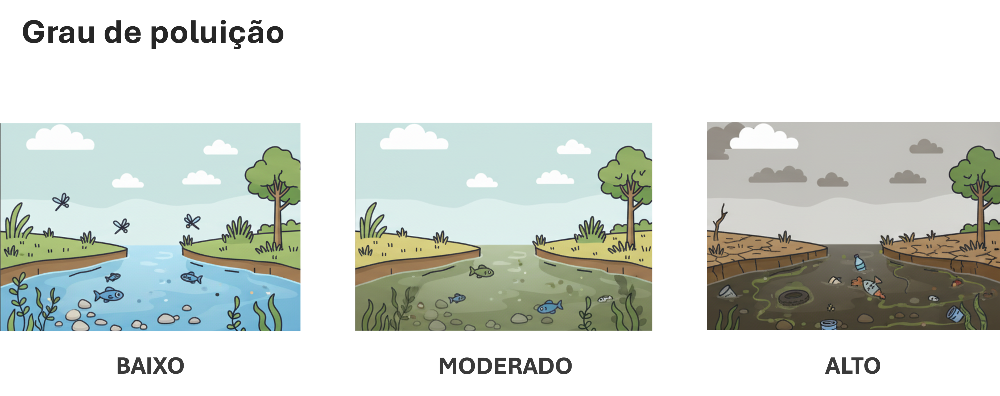
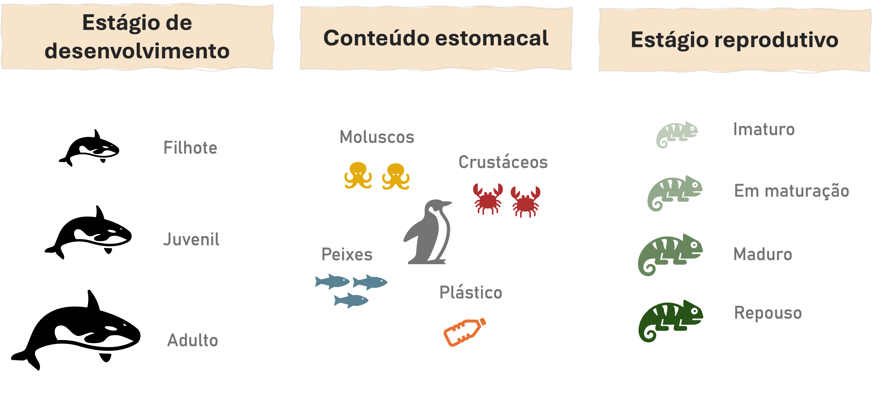
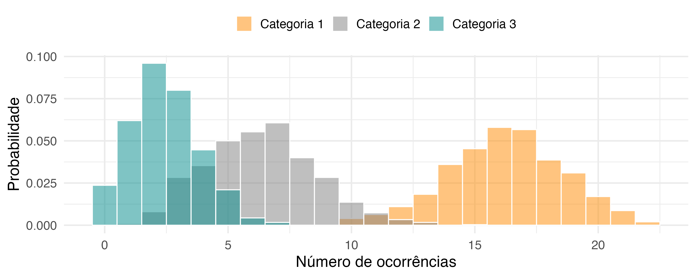

## <span style="color: #ee6c4d;">Conteúdo programático </span> 

<br>


**1. O que é um dado categórico?**  


**2. Distribuição Multinomial**  


- Sugestão de leitura:
  - Cap. 7: Extending the Linear model with R (Faraway)

---
class: inverse, center, middle

# O que é um dado categórico?

---
## <span style="color: #ee6c4d;">Dados categóricos </span>


Informação que descreve caracaterísticas da população e/ou experimento 
- Nominal
- Ordinal


---
## <span style="color: #ee6c4d;">Dados categóricos </span><span style="color: #3e5c76;">| Nominal </span> 

Quando as categorias não possuem ordem natural

```{r echo=FALSE, out.width ="100%", fig.align ='center'}

```


---
## <span style="color: #ee6c4d;">Dados categóricos </span><span style="color: #3e5c76;">| Nominal </span> 

Quando as categorias não possuem ordem natural

```{r echo=FALSE, out.width ="100%", fig.align ='center'}

```


---
## <span style="color: #ee6c4d;">Dados categóricos </span><span style="color: #3e5c76;">| Ordinal </span> 

Quando as categorias apresentam uma sequência natural de ocorrência

```{r echo=FALSE, out.width ="100%", fig.align ='center'}

```


---
## <span style="color: #ee6c4d;">Dados categóricos </span><span style="color: #3e5c76;">| Ordinal </span> 

Quando as categorias apresentam uma sequência natural de ocorrência

```{r echo=FALSE, out.width ="100%", fig.align ='center'}

```


---
## <span style="color: #ee6c4d;">Dados categóricos </span>

Na maioria dos casos, o foco está em descrever características da população

```{r echo=FALSE, out.width ="100%", fig.align ='center'}

```

---

## <span style="color: #ee6c4d;">Exemplo prático </span>

---

class: inverse, center, middle

# Distribuição Multinomial

---

## <span style="color: #ee6c4d;">Distribuição Multinomial </span>

É uma extensão da distribuição binomial
  - $Y$ pode assumir mais do que 2 categorias

<br>

$$\large Y = \begin{bmatrix} Y_1 \\ Y_2 \\ \vdots \\Y_K  \end{bmatrix}, ~~ \text{com} \sum_{k=1}^{K} Y_k = n$$
- **k = **número de categorias
- **n = ** número de amostras

---

## <span style="color: #ee6c4d;">Distribuição Multinomial </span>

$$\large f(\mathbf{y};\,n,\mathbf{p}) \;=\; \frac{n!}{y_1!\,y_2!\,\cdots\,y_k!}\;
\prod_{j=1}^k p_i^{\,y_i}$$

<br>

- $\large y = (y_1, y_2, \dots ,y_k):$ número de amostras em cada categoira 
- $\large p = (p_1, p_2, \dots, p_k):$ probabilidades de cada categoria
  - $\large p_1 + p_2 + \dots, + ~ p_k = 1$

--
<br>

Quando k = 2

--

$$\large \underbrace{f(y;\,n,p) = \binom{n}{y} p^y (1-p)^{n-y}}_{Distribuição ~ binomial}$$
---
## <span style="color: #ee6c4d;">Distribuição Multinomial </span>

<br>

```{r echo=FALSE, out.width ="100%", fig.align ='center'}

```

---
## <span style="color: #ee6c4d;">Distribuição Multinomial </span>

<br>

$$\large Y \sim MultiNomial(n, \mathbf{p)}$$


$$\large E[Y_k] = np_k, ~~~~~Var(Y_k) =np_k(1-p_k)$$

--

<br>


$$\large log(\frac{p_k}{p_1}) = \eta_k = x^T\beta_k, \quad k=2,...,K$$

--

.pull-left[
**Probabilidade da categoria de referência**

$$\large p_1 = \frac{1}{1+\sum_{j=2}^{K}\text{exp}(\eta_j)}$$

]

--
.pull-right[

**Probabilidade das demais categorias**

$$\large p_k = \frac{\text{exp}(\eta_k)}{1+\sum_{j=2}^{K}\text{exp}(\eta_j)}$$

]

---


---