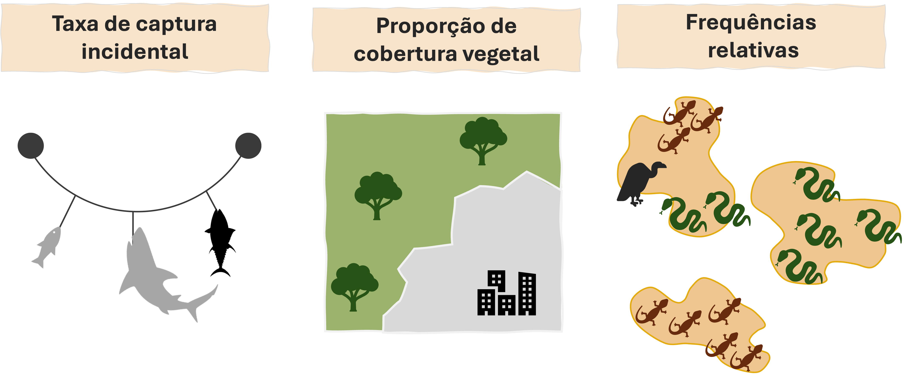
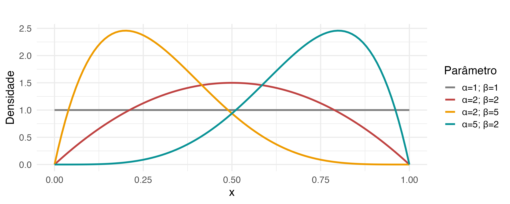
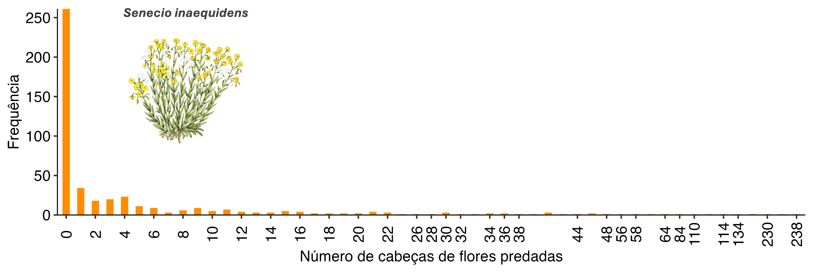
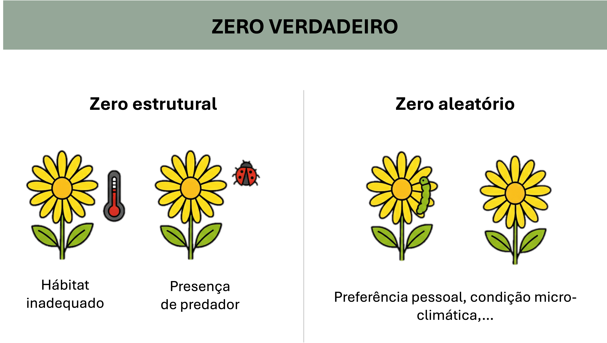
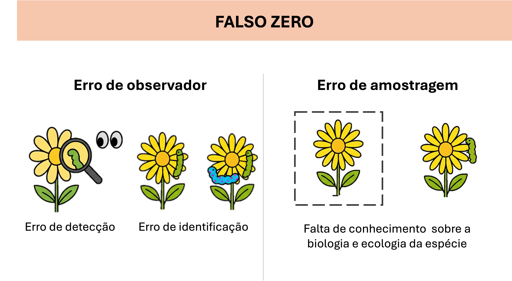
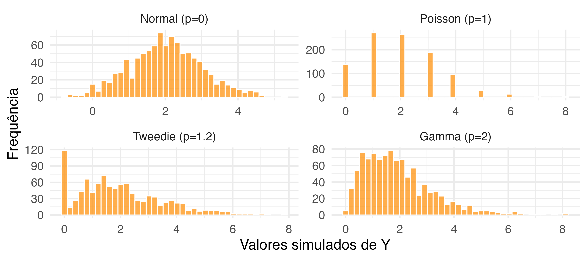

## <span style="color: #ee6c4d;">Conteúdo programático </span> 

<br>


**1. Distribuição Beta**  

> Prática 


**2. Distribuições para dados zero-inflacionados**  

> Prática 


**3. Distribuições Tweedie**  

> Prática 


---

## <span style="color: #ee6c4d;">Leitura sugerida </span> 


.pull-left[
**Livros**

- **Cap. 11:** Zuur et al. (2009)
- **Cap. 4:** Bolker (2008)
- **Cap. 3 (seção 3.6):** Faraway (2016)
- **Cap. 5 (seção 5.5):** Faraway (2016)
- **Cap. 9 (seção 9.5):** Faraway (2016)
- **Cap. 7 (seção 7.4):** Agresti (2015)
]


.pull-right[
**Artigos**

**Moreno, A.B.** (2019). What does a zero mean? Understanding false, random and structural zeros in ecology. Methods in Ecology and Evolution. https://doi.org/10.1111/2041-210X.13185

**Bonat, W.H. et al.** (2016). Extended Poisson-Tweedie: properties and regression models for count data. https://doi.org/10.48550/arXiv.1608.06888
 
]


---
class: inverse, center, middle

# Distribuição Beta

---
## <span style="color: #ee6c4d;">Distribuição Beta </span>

Adequado para variáveis expressas em proporções, frequências relativas ou probabilidades

<br>

```{r echo=FALSE, out.width ="100%", fig.align ='center'}

```


---
## <span style="color: #ee6c4d;">Distribuição Beta </span>


A distribuição Beta é uma distribuição de *probabilidade contínua* definida no intervalo [0, 1]

$$\large f(y | \alpha, \beta) = \frac{\Gamma(\alpha+\beta)}{\Gamma(\alpha)\Gamma(\beta)}y^{\alpha-1}(1-y)^{\beta-1}, \quad 0  < y < 1 $$

```{r echo=FALSE, out.width ="90%", fig.align ='center'}

```

---

## <span style="color: #ee6c4d;">Distribuição Beta </span>

<br>

$$\large Y \sim Beta(\alpha,\beta)$$

$$\large E(Y) = \frac{\alpha}{\alpha + \beta}, \quad Var(Y) = \frac{\alpha \beta}{(\alpha+\beta)^2 (\alpha+\beta+1)}$$

<br>

--

Versão reparametrizada $(\mu, \phi)$:

$$\large \mu = \frac{\alpha}{\alpha+\beta}, \quad \phi = \alpha + \beta$$
$$\large \alpha = \mu \phi, \quad \beta = \phi(1-\mu)$$

---
## <span style="color: #ee6c4d;">Distribuição Beta </span>

<br>

$$\large Y \sim Beta(\mu\phi, ~\phi(1-\mu))$$

$$\large E(Y) = \mu, \quad Var(Y) = \frac{\mu(1-\mu)}{1+\phi}$$

<br>

$$\large logit(\mu) = \eta = \beta_0 + \sum_{j=1}^{p} \beta_j x_{j}$$

--

Lembrando que:

$\large logit(\mu) = \frac{\mu}{1-\mu}$

---
## <span style="color: #ee6c4d;">Prática no R </span>


<br>


```{r echo=FALSE, out.width ="25%", fig.align ='center', fig.cap="Pratica_aula_07_betareg.R <br>", fig.topcaption=F}
knitr::include_graphics("../Figuras/Rlogo.png")
```

---
class: inverse, center, middle

# Distribuições para dados zero-inflacionados

---
## <span style="color: #ee6c4d;">Dados zero-inflacionados </span>


Dados de contanges muitas vezes apresentam um excesso de zeros


<br>

```{r echo=FALSE, out.width ="90%", fig.align ='center', fig.topcaption=F}

```


.footnote[Moreno et al. (2019).  https://doi.org/10.1111/2041-210X.13185 ]

---
## <span style="color: #ee6c4d;">Dados zero-inflacionados </span>


É preciso distinguir a natureza dos zeros:


```{r echo=FALSE, out.width ="80%", fig.align ='center', fig.topcaption=F}

```

---
## <span style="color: #ee6c4d;">Dados zero-inflacionados </span>


É preciso distinguir a natureza dos zeros:


```{r echo=FALSE, out.width ="80%", fig.align ='center', fig.topcaption=F}

```


---
## <span style="color: #ee6c4d;">Dados zero-inflacionados </span>

<p class="comment">
<b>LEMBRANDO</b>
<br>

Dados de contagens são (frequentemente) modelados via as distribuições Poisson e Binomial Negativa!

</p>

---
## <span style="color: #ee6c4d;">Dados zero-inflacionados </span>


Há duas formas de se abordar um dado zero-inflacionado:

  - **Modelos de mistura (ZIP/ZINB)**
    - Assume que os dados foram gerados por dois processos paralelos:
      - <u>Processo binário</u>: determina se a observação será um zero 'extra' (i.e., zero-estrutural/zero verdadeiro).
      > **<u>Foco:</u>** ausência da espécie.
      - <u>Processo Poisson/BN</u>: considera que as contagens advém de um processo Poisson, podendo gerar qualquer valor inteiro não negativo, incluindo zeros (i.e., zero-amostral/falso zero).


.footnote[ZIP = Zero-inflated Poisson; ZINB = Zero-inflated Negative Binomial]


--

> <span style="color: #ee6c4d;">**Distingue os diferentes tipos de zeros:** "zero verdadeiro" (do processo binário), "falso zero" (do processo Poisson). </span>


---
## <span style="color: #ee6c4d;">Dados zero-inflacionados </span>


Há duas formas de se abordar um dado zero-inflacionado:

  - **Modelos em dois estágios (ZAP/ZANB)**
    - Também assume que os dados foram gerados em duas etapas:
      - <u>Processo binário:</u> decide se a espécie está presente ou ausente; logo, atua como barreira separando os zeros dos números positivos. 
      > **<u>Foco:</u>** presença da espécie.
      - <u>Processo Poisson/BN truncado:</u> considera que as contagens surgiram de um processo Poisson/NB truncado em zero ( exclui os zeros)

.footnote[ZAP = Zero-altered Poisson; ZANB = Zero-altered Negative Binomial; Hurdle models]

--

> <span style="color: #ee6c4d;">**Não distingue os diferentes tipos de zeros:** todos os zeros são gerados apenas pelo processo binário.</span>

---

## <span style="color: #ee6c4d;">Dados zero-inflacionados </span><span style="color: #3e5c76;">| ZIP/ZINB </span>


Considere $Y_i$ o número de flores predadas na amostra $i$

<br>


$$\large P(Y_i = y_i) =  \left\{ \begin{array}{lr}
\pi_i + (1-\pi_i) \times f(y_i|\theta)
& y_i = 0 \\ (1-\pi_i) \times f(y_i|\theta) & y_i > 0
\end{array}\right.$$

onde:
- $\pi_i:$ probabilidade de um zero estrutural (descrito por uma distribuição Binomial)
- $f(y_i|\theta):$ distribuição de probabilidade para dado discreto (Poisson/Binomial Negativa) 


--

<br>

> <span style="color: #ee6c4d;">**Para entender melhor o modelo, precisamos decompor as equações em $\mathbf{P(Y_i = 0)}$ e $\mathbf{P(Y_i > 0)}$ </span>**

---

## <span style="color: #ee6c4d;">Dados zero-inflacionados </span><span style="color: #3e5c76;">| ZIP/ZINB </span>


Se assumirmos que $Y_i$ segue uma distribuição Poisson, teremos que:


$$\large f(y_i|\theta) = \frac{\lambda^{y_i} \times e^{\lambda_i}}{y_i!}$$
--

.pull-left[

**Quando $\large \mathbf{y_i = 0}$ **

$$\large P(Y_i = 0) = \pi_i + (1-\pi_i) \times \frac{\lambda^{0} \times e^{-\lambda_i}}{0!}$$
]

---
## <span style="color: #ee6c4d;">Dados zero-inflacionados </span><span style="color: #3e5c76;">| ZIP/ZINB </span>


Se assumirmos que $Y_i$ segue uma distribuição Poisson, teremos que:


$$\large f(y_i|\theta) = \frac{\lambda^{y_i} \times e^{\lambda_i}}{y_i!}$$


.pull-left[

**Quando $\large \mathbf{y_i = 0}$ **

$$\large P(Y_i = 0) = \pi_i + (1-\pi_i) \times \frac{\lambda^{0} \times e^{-\lambda_i}}{0!}$$
Portanto:
$$\large P(Y_i = 0) = \pi_i + (1-\pi_i) \times  e^{-\lambda_i}$$

]

---

## <span style="color: #ee6c4d;">Dados zero-inflacionados </span><span style="color: #3e5c76;">| ZIP/ZINB </span>


Se assumirmos que $Y_i$ segue uma distribuição Poisson, teremos que:


$$\large f(y_i|\theta) = \frac{\lambda^{y_i} \times e^{\lambda_i}}{y_i!}$$


.pull-left[

**Quando $\large \mathbf{y_i = 0}$ **

$$\large P(Y_i = 0) = \pi_i + (1-\pi_i) \times \frac{\lambda^{0} \times e^{-\lambda_i}}{0!}$$
Portanto:
$$\large P(Y_i = 0) = \pi_i + (1-\pi_i) \times  e^{-\lambda_i}$$

]

.pull-right[
**Quando $\large \mathbf{y_i > 0}$ **

$$\large P(Y_i = y_i) = (1-\pi_i) \times  \frac{\lambda^{y_i} \times e^{\lambda_i}}{y_i!}$$

]


---
## <span style="color: #ee6c4d;">Dados zero-inflacionados </span><span style="color: #3e5c76;">| ZIP/ZINB </span>

Se assumirmos que $Y_i$ segue uma distribuição Poisson, teremos que:


$$\large Y_i \sim ZIP(\pi_i, \lambda_i)$$
$$\large E(Y_i) = \lambda_i \times (1-\pi_i), \quad Var(Y_i) = (1-\pi_i)\times(\lambda_i + \pi_i\times\lambda^{2}_i)$$


---

## <span style="color: #ee6c4d;">Dados zero-inflacionados </span><span style="color: #3e5c76;">| ZIP/ZINB </span>

Se assumirmos que $Y_i$ segue uma distribuição Poisson, teremos que:


$$\large Y_i \sim ZIP(\pi_i, \lambda_i)$$
$$\large E(Y_i) = \lambda_i \times (1-\pi_i), \quad Var(Y_i) = (1-\pi_i)\times(\lambda_i + \pi_i\times\lambda^{2}_i)$$

<br>

.pull-left[

<br>

$\large logit(\pi_i) = \gamma_0 + \gamma_1Z_{i,1} + \cdots + \gamma_pZ_{i,p}$

$\large log(\lambda_i) = \beta_0 + \beta_1X_{i,1} + \cdots + \beta_pX_{i,p}$
]

.pull-right[
<p class="comment">
<b>ATENÇÃO</b>
<br>

Podemos adicionar covariáveis tanto no processo Binomial quanto no processo Poisson. 

</p>
]


---

## <span style="color: #ee6c4d;">Dados zero-inflacionados </span><span style="color: #3e5c76;">| ZIP/ZINB </span>


Quando o modelo ZIP ainda apresenta sobredispersão, pode-se recorrer à versão zero-inflacionada do modelo Binomial Negativo:


$$\large P(Y_i = y_i) =  \left\{ \begin{array}{lr} \pi_i + (1-\pi_i) \times f_{NB}(y_i|\theta) & y_i = 0 \\ (1-\pi_i) \times f_{NB}(y_i|\theta) & y_i > 0 \end{array}\right.$$

onde:
- $\pi_i:$ probabilidade de um zero estrutural (descrito por uma distribuição Binomial)
- $f_{NB}(y_i|\theta)$ função da distribuição Binomial Negativa
  - $f(y; \mu, k) = \frac{\Gamma(y+k)}{\Gamma(k)\times\Gamma(y+1)} \times \left (\frac{k}{\mu + k}\right)^k \times \left(1 - \frac{k}{\mu + k}\right)^y$

---

## <span style="color: #ee6c4d;">Dados zero-inflacionados </span><span style="color: #3e5c76;">| ZIP/ZINB </span>

A versão zero-inflacionada da distribuição Binomial Negativa pode ser representada conforme:

$$\large Y_i \sim ZINB(\pi_i, \mu_i, k)$$
$\large E(Y_i) = \mu_i \times (1-\pi_i)$

$\large Var(Y_i) = (1-\pi_i)\times(\mu_i + \frac{\mu^2_i}{k})~ +~ \mu^2_i \times (\pi^2_i + \pi_i)$

<br>

--

$\large logit(\pi_i) = \gamma_0 + \gamma_1Z_{i,1} + \cdots + \gamma_pZ_{i,p}$

$\large log(\mu_i) = \beta_0 + \beta_1X_{i,1} + \cdots + \beta_pX_{i,p}$

---

## <span style="color: #ee6c4d;">Dados zero-inflacionados </span><span style="color: #3e5c76;">| ZAP/ZANB </span>

Os exemplos anteriores são aplicados para casos em que se quer discernir as diferentes fontes de zeros
  - Há casos em que não se quer/sabe diferenciar as fontes de zeros
      - ***hurdle models*** (ZAP/ZANB)

--

- Baseados em dois processos ecológicos bem definidos:
  1. Processo causando a ausência do animal
  2. Processo influenciando a abundância do animal (dado que ele esteja presente)


---

## <span style="color: #ee6c4d;">Dados zero-inflacionados </span><span style="color: #3e5c76;">| ZAP/ZANB </span>


Os exemplos anteriores são aplicados para casos em que se quer discernir as diferentes fontes de zeros
  - Há casos em que não se quer/sabe diferenciar as fontes de zeros
      - ***hurdle models*** (ZAP/ZANB)

- Baseados em dois processos ecológicos bem definidos:
  1. Processo causando a ausência do animal
  2. Processo influenciando a abundância do animal (dado que ele esteja presente)

Similar aos modelos ZIP/ZINB, porém:
  - **Processo binomial:** considera a probabilidade de presença vs. ausência (ZIP/ZINB consideram a probabiliade de zero-verdadeiro, i.e., ausência vs. presença)
  - **Processo Poisson/NB:** considera a distribuição truncada em zero (não gera zeros)

---

## <span style="color: #ee6c4d;">Dados zero-inflacionados </span><span style="color: #3e5c76;">| ZAP/ZANB </span>

**Distribuição truncada**

Podemos ajustar a função Poisson/Binomial Negativa de forma a excluir os zeros da distribuição

--

Considerando uma distribuição Poisson, temos:

$$\large f(y_i; \lambda_i) = \frac{\lambda^{y_i} \times e^{-\lambda_i}}{y!}$$
--

Para $y_i = 0$, teremos:
$$\large f(y_i=0; \lambda_i) = e^{-\lambda_i}$$
--

Exclui-se os zeros da distribuição dividindo-a pelos casos em que $y_i = 0$

$$\large f(y_i > 0; \lambda_i) = \frac{\lambda^{y_i} \times e^{-\lambda_i}}{(1-e^{-\lambda_i})\times y!}$$

---

## <span style="color: #ee6c4d;">Dados zero-inflacionados </span><span style="color: #3e5c76;">| ZAP/ZANB </span>

**Distribuição truncada**

Pode-se aplicar o mesmo raciocínio para a distribuição Binomial Negativa:


$$\large f(y_i > 0; \mu_i, k) = \frac{\frac{\Gamma(y_i+k)}{\Gamma(k)\times\Gamma(y_i+1)} \times \left (\frac{k}{\mu_i + k}\right)^k \times \left(1 - \frac{k}{\mu_i + k}\right)^{y_i}} {1 - \left (\frac{k}{\mu_i + k}\right)^k}$$

---
## <span style="color: #ee6c4d;">Dados zero-inflacionados </span><span style="color: #3e5c76;">| ZAP/ZANB </span>

Podemos resumir os *hurdle models* conforme a estrutura:


$$\large P(Y_i = y_i) =  \left\{ \begin{array}{lr}
p_i 
& y_i = 0 \\ (1-p_i) \times f^+(y_i|\theta) & y_i > 0
\end{array}\right.$$


onde:
- $p_i:$ probabilidade da presença da espécie
- $f^+(y_i|\theta):$ distribuição de probabilidade Poisson ou Binomial Negativa *truncada*

---

## <span style="color: #ee6c4d;">Prática no R </span>


<br>


```{r echo=FALSE, out.width ="25%", fig.align ='center', fig.cap="Pratica_aula_07_zeroinflacionado.R <br>", fig.topcaption=F}
knitr::include_graphics("../Figuras/Rlogo.png")
```

---
class: inverse, center, middle

# Distribuição Tweedie

---

## <span style="color: #ee6c4d;">Distribuição Tweedie </span>

É um caso especial da família exponencial de distribuições
- Distribuição *híbrida*: contínua e discreta (depende do parâmetro $p$)

<br>

--

$$\large Y \sim Tw_p(\mu, \sigma^2)$$

$$E(Y) = \mu, \quad Var(Y) = \phi\mu^p$$


onde:
- $\mu:$ média
- $\phi:$ dispersão
- $p:$ parâmetro de potência (define o tipo de distribuição) 


---
## <span style="color: #ee6c4d;">Distribuição Tweedie </span>

<br>

```{r echo=FALSE, out.width ="100%", fig.align ='center'}

```

---

## <span style="color: #ee6c4d;">Distribuição Tweedie </span>

A distribuição torna-se particularmente útil para dados com:
- forte assimetria
- excesso de zeros
- valores positivos


--

<br>

> Na dúvida, sempre testar essa distribuição em casos de dados zero-inflacionados (poisson, binomial negativa, e gama) 

---

## <span style="color: #ee6c4d;">Prática no R </span>

<br>

```{r echo=FALSE, out.width ="25%", fig.align ='center', fig.cap="Pratica_aula_07_zeroinflacionado.R <br>", fig.topcaption=F}
knitr::include_graphics("../Figuras/Rlogo.png")
```

---