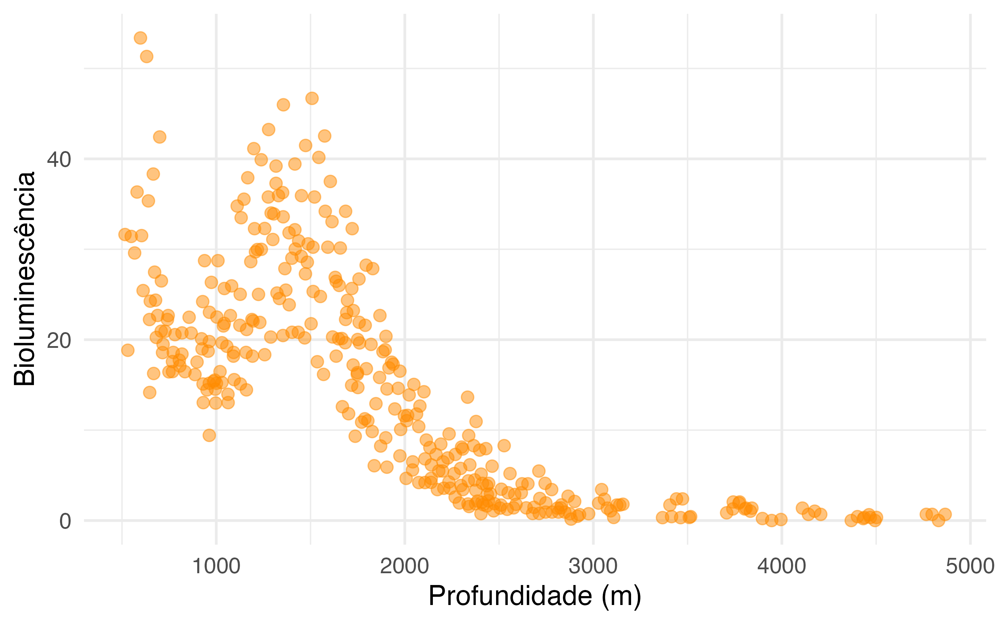
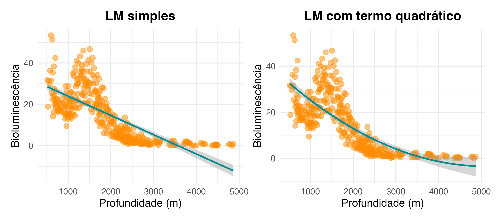
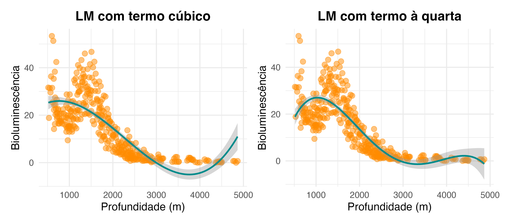
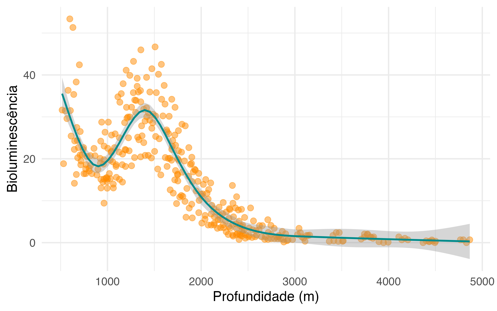
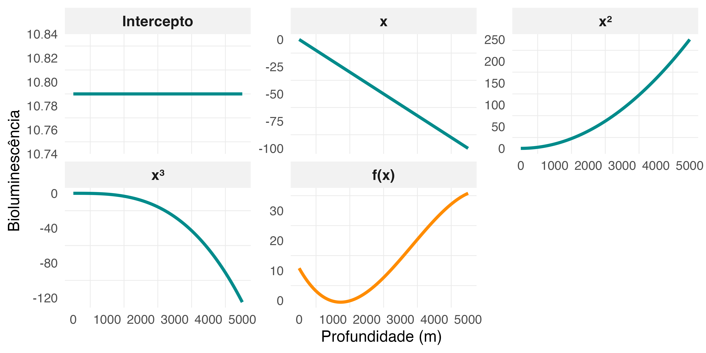
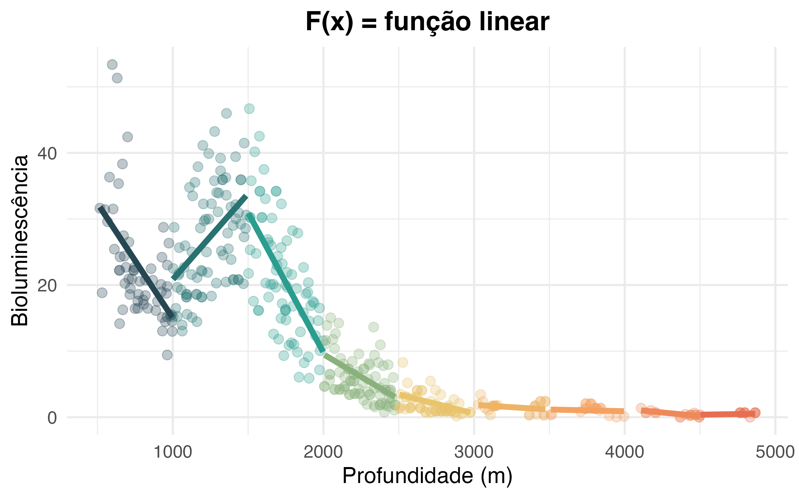
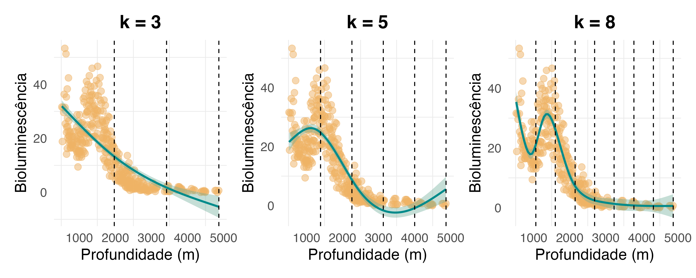

## <span style="color: #ee6c4d;">Conteúdo programático </span> 

<br>


**1. O que é um GAM?**  

> Prática 


---

## <span style="color: #ee6c4d;">Leitura sugerida </span> 


**Livros**

- **Cap. 3:** Zuur et al. (2009)
- **Caps. 4 & 5:** Wood (2017)


**Artigos**

- **Guisan, A. et al.** (2002). Generalized linear and generalized additive models in studies of species distributions: setting the scene. Ecological Modelling. https://doi.org/10.1016/S0304-3800(02)00204-1 
 

**Material alternativo**
- [Generalized Additive Models:](https://m-clark.github.io/generalized-additive-models/) Clark (Ano não informado)


---
class: inverse, center, middle

# O que é um GAM?

---

#### Muitos processos ecológicos não apresentam uma relação linear...


```{r echo=FALSE, out.width ="80%", fig.align ='center'}

```

.footnote[Gillibrand et al. (2007). https://doi.org/10.3354/meps341037]

---

#### ...e que não conseguem ser captados por termos polinomiais 

<br>

```{r echo=FALSE, out.width ="100%", fig.align ='center'}

```


---

#### ...e que não conseguem ser captados por termos polinomiais 

<br>


```{r echo=FALSE, out.width ="100%", fig.align ='center'}

```

---

#### Para esses casos, pode-se recorrer a um Modelo Aditivo Generalizado (GAM) 


```{r echo=FALSE, out.width ="90%", fig.align ='center'}

```


---

## <span style="color: #ee6c4d;">O que é um GAM? </span>


Considere o seguinte GLM:


$$\large y \sim N(\mu,\sigma^2) $$

$$\large g(\mu) = \eta = \beta_0 + \beta_1x_1$$

<br>

--

Representamos um GAM conforme

$$\large g(\mu) = \eta = f(x)$$

<br>

$f(x)$: função suavizadora (*spline*) 


---

## <span style="color: #ee6c4d;">O que é um GAM? </span>


Na essência, o spline é uma junção de várias funções base (lineares ou não)


$$\large \eta = f(x) = \sum_{j=1}^{d}F_j(x)\beta_j$$

onde:

$F_j(x)$: funções base (controlam a suavização)

$\beta_j$: parâmetros da regressão ($\beta_0, \beta_1, ...$)

---

## <span style="color: #ee6c4d;">O que é um GAM? </span>

Um exemplo de uma função base é a função polinomial com $d$ graus

<br>

$$\large f(x) = \beta_0 + \beta_1x^{1} + ~... ~+ ~\beta_dx^d$$

<br>

--

Imaginemos uma função polinomial de terceiro grau ($d = 3$)

<br>

$$\large f(x) = \beta_0 + \beta_1x^{1} + \beta_2x^{2} + \beta_3x^{3}$$
<br>

Funções base: $\beta_0(x) = 1, \quad \beta_1(x) = x, \quad \beta_2(x) = x^2, \quad \beta_3(x) = x^3$


---

## <span style="color: #ee6c4d;">O que é um GAM? </span>

$$\large f(x) = \beta_0 + \beta_1x^{1} + \beta_2x^{2} + \beta_3x^{3}$$

```{r echo=FALSE, out.width ="95%", fig.align ='left'}

```


---

## <span style="color: #ee6c4d;">O que é um GAM? </span>

O GAM, portanto, pode ser visto como uma junção de várias regressões localizadas 

```{r echo=FALSE, out.width ="80%", fig.align ='center'}

```

---


## <span style="color: #ee6c4d;">O que é um GAM? </span>

A questão é achar o melhor *spline*...

```{r echo=FALSE, out.width ="80%", fig.align ='center'}

```

---

## <span style="color: #ee6c4d;">O que é um GAM? </span>

...bem como o melhor número de nós (*knots*)


```{r echo=FALSE, out.width ="95%", fig.align ='center'}

```


> **ATENÇÃO:** sobreajuste dos dados quando $k$ é grande

---

## <span style="color: #ee6c4d;">O que é um GAM? </span>

Para evitar o sobreajuste, os GAMs introduzem um termo de penalização nas funções suavizadoras


$$\large L(\beta) = L(\beta) - \underbrace{\frac{1}{2} \lambda \, \beta^\top \mathbf{S} \beta}_\text{penalização}$$

.pull-left[
onde:

- $L(\beta)$ = função de verossimilhança
- $\lambda$ = parâmetro de suavização
- $\mathbf{S}$ = matriz que mede a 'rugosidade' da função

]

.pull-right[

<br>

- Quando $\lambda \rightarrow 0$: sem penalização e maior risco de sobreajuste

- Quando $\lambda \rightarrow \infty$: maior penalização

> $\lambda$ é estimado pelo modelo

]

---

## <span style="color: #ee6c4d;">Prática no R </span>

<br>

```{r echo=FALSE, out.width ="25%", fig.align ='center', fig.cap="Pratica_aula_08.R <br>", fig.topcaption=F}
knitr::include_graphics("../Figuras/Rlogo.png")
```

