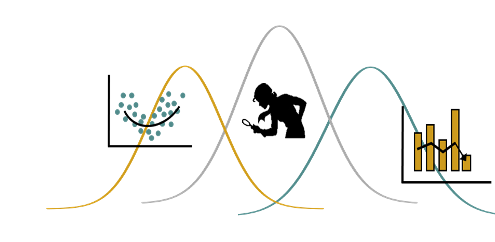

# ECL0072 (2025-2)

<p align="center">

</p>


## Tópicos Especiais em Ecologia - Modelos Lineares Generalizados e Aditivos para Dados Ecológicos

Curso ministrado para o Programa de Pós-Graduação em Ecologia (PPGECO) na UFRN, durante o segundo semestre de 2025.

Este repositório contém todo o material de aula e os arquivos necessários para gerar a página da disciplina.


### Acessando o conteúdo do curso

A página do curso é toda construída usando apenas o [R Markdown][] e, por isso, o código fonte pode ser acessado nos arquivos `Rmd`. Para gerar o site você precisará
instalar (ou atualizar) os pacotes `rmarkdown` e `knitr`.

Para acessar o conteúdo do curso, siga as intruções abaixo:

1. Copie (ou fork) esse repositório
2. Apague o diretório `site_libs/`
3. Abra o R nesse diretório, carregue os pacotes e renderize o site com
   `render_site()`, conforme indicado abaixo
4. Clique no arquivo *index.html* e abre ele com a opção *browser*

<br>

```r

# Instalando os pacotes
#~~~~~~~~~~~~~~~~~~~~~~~~

## Pacotes principais ##
install.packages("knitr")
install.packages("rmarkdown"")


## Pacotes adicionais ##
install.packages("bookdown")
install.packages("kableExtra")
install.packages("tinytex")
install.packages("tinytex")
install.packages("dplyr")
install.packages("ggplot2")
install.packages("DHARMa")
install.packages("performance")


# Compila o site da disciplina
#~~~~~~~~~~~~~~~~~~~~~~~~~~~~~~
library(knitr)
library(rmarkdown)
render_site()


```

### Licença

O conteúdo deste repositório, das páginas, e do material da disciplina
está está disponível por meio da [Licença Creative Commons 4.0][]
(Atribuição/NãoComercial/PartilhaIgual).


[Licença Creative Commons 4.0]: https://creativecommons.org/licenses/by-nc-sa/4.0/deed.pt_BR
[R Markdown]: http://rmarkdown.rstudio.com
